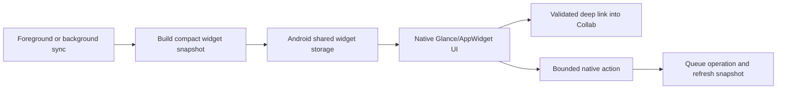

# Mobile Widget Ideas

## Purpose

This is the original idea catalog. The ideas have been accepted for Android and
their committed delivery sequence, architecture, and release gates now live in
the [Mobile Widgets Integration Plan](./mobile-widgets-plan.md). Android
is the first relevant platform because Collab currently has an Android companion
app. The same product ideas can be revisited for iOS if that client is added
later.

Widgets should expose a small useful slice of already cached data. They should
not start the full Tauri webview, contain credentials, or become a second
calendar/notes application.

## Strong First Candidate

### Calendar Agenda

A resizable widget showing:

- current date and next few events, tasks, deadlines, and birthdays
- calendar accent colors and small item-type icons
- time, all-day state, and overdue/completed state
- a configurable set of local and hosted calendars
- tap item to open its Collab day/item view
- tap header to open Today
- optional add button to open the existing item creator

Small size can show the next item. Medium size can show today. Large size can
show today plus tomorrow or a compact week agenda.

## Other Widget Ideas

### Month Calendar

- compact month grid
- dots or short accent bars for days with entries
- today highlight
- tapping a day opens that day in Collab

### Tasks

- next due and overdue calendar/Kanban tasks
- filter by server, vault, board, assignee, or calendar
- optional Mark complete action after a native confirmation

### Quick Capture

- New note
- New task
- New calendar event
- Upload photo or file

Each action should deep-link into the real mobile creation flow. The widget
should not duplicate complex editors.

### Sync Status

- last successful background sync
- queued changes and action-required failures
- Sync now action
- clear offline/authentication state without exposing server details on the
  lock screen

This is primarily useful during rollout and troubleshooting; it may be too
operational for a default consumer widget.

### Vault Shortcuts

- user-selected notes, Kanban boards, PDFs, or folders
- recent files
- one-tap open into the correct server and vault

### Birthday And Countdown

- next birthdays and optionally event countdowns
- privacy-safe display mode
- direct open to the calendar item

## Simple Integration Flow

1. Existing foreground/background sync produces a compact, versioned snapshot.
2. Native Android code stores only the fields required by configured widgets.
3. A native Glance/AppWidget receiver renders the snapshot without launching
   the Tauri activity.
4. Taps open validated Collab deep links. Simple actions queue an idempotent
   native operation and request a refresh.
5. WorkManager refreshes snapshots after relevant sync jobs and at
   OS-controlled intervals.

## Suggested Technical Boundary

- Kotlin/Glance owns widget layout, resizing, launcher registration, and tap
  intents.
- Shared Rust/Collab logic owns data selection, authorization, operation
  validation, and snapshot generation.
- Widget storage contains no access tokens, refresh tokens, document bodies, or
  unnecessary private metadata.
- Every snapshot is keyed by user profile and widget configuration so multiple
  servers and local calendars remain isolated.
- Widget actions use the same pending-operation and sync paths as the app.

## Product Constraints

- Lock-screen and launcher privacy must be configurable.
- Stale data should show a subtle last-updated state instead of silently
  appearing current.
- Widgets must remain useful offline.
- A missing or signed-out server should degrade per source, not blank all local
  calendars.
- Battery use must be event/sync driven; a widget is not a reason to poll every
  few minutes.
- Visuals should follow Android widget conventions while retaining Collab
  accent colors and item-type semantics.

The calendar agenda remains the first implementation because it proves the
shared snapshot, privacy, lifecycle, and deep-link foundation used by the other
accepted widgets.
