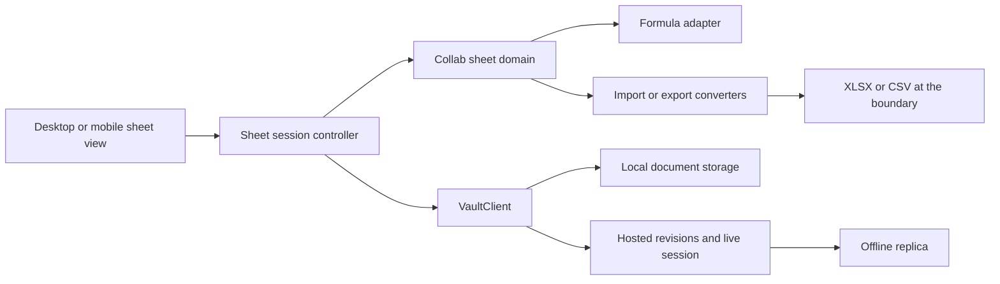

# Advanced Tables Plan

## Summary

Add a first-party spreadsheet document to Collab as a new `.sheet` vault file
type with its own desktop editor and mobile experience. Advanced Tables should
cover the common spreadsheet workflow: multiple worksheets, typed cells,
formulas, formatting, fast range operations, sorting, filtering, charts, and
collaborative hosted editing.

The existing Grid view is not the spreadsheet foundation. Grid remains
app-local workspace layout state used to arrange other Collab views. A `.sheet`
file is a portable vault document with normal revisions, offline caching,
hosted synchronization, and document-session behavior.

Excel and CSV are conversion formats only. The final compatibility phase may
import `.xlsx` and `.csv` into `.sheet` and export `.sheet` to those formats.
Collab will not open either format as its live backing model, promise lossless
round trips, or attempt complete Excel compatibility.

## Goals

- Provide a fast desktop spreadsheet editor that feels native to Collab.
- Store workbooks in a documented, schema-versioned `.sheet` format.
- Support multiple worksheets, formulas, typed values, styles, ranges, and
  common data operations.
- Work in local and hosted vaults through the existing `VaultClient` and
  document-session boundaries.
- Support offline copies, optimistic revisions, history, and collaboration.
- Share document parsing, formula semantics, and mobile rendering instead of
  creating platform-specific spreadsheet implementations.
- Integrate with normal Collab files, links, attachments, and command surfaces.
- Convert selected `.xlsx` and `.csv` content at import/export boundaries.

## Non-Goals

- Replacing the existing Grid workspace view.
- Reimplementing every Excel function, chart, pivot, add-in, or automation
  feature.
- Opening `.xlsx` or `.csv` in place as editable source documents.
- Lossless `.xlsx` round trips or byte-for-byte preservation.
- Running VBA, Office Scripts, macros, Power Query, external workbook links,
  external data connections, or arbitrary formula code.
- Server-side formula evaluation as an authorization or persistence
  requirement.
- Real-time multi-user cursor presence in the first editor phase.
- Using a DOM node for every cell in a large worksheet.

## Product Model

### File Type

- Extension: `.sheet`
- Media type: `application/vnd.collab.sheet+json`
- Document kind: `collab-sheet`
- Initial schema version: `1`
- Storage: sparse structured JSON, written through normal local/hosted document
  APIs.
- One file represents one workbook containing one or more worksheets.

`.table` is intentionally not used for the initial extension. “Table” usually
implies one record-oriented dataset, while the requested feature needs a
multi-worksheet workbook with formulas and free-form cell placement.

### Workbook Behavior

Initial workbook capabilities:

- create, rename, duplicate, reorder, hide, and delete worksheets
- add, remove, resize, hide, and reorder rows and columns
- freeze rows and columns
- select cells, ranges, rows, columns, and disjoint ranges where supported
- enter text, numbers, booleans, dates, times, and formulas
- fill, copy, cut, paste, clear, and drag ranges
- merge and unmerge bounded ranges
- sort and filter tabular ranges
- search and replace within a sheet or workbook
- undo and redo structural, value, formula, and formatting operations

### Formula Baseline

Use a proven formula engine with a compatible license and active maintenance.
Do not hand-roll parsing, dependency graphs, cycle detection, or recalculation.
Wrap the selected engine behind Collab-owned types so its data model does not
become the `.sheet` schema.

The initial function set should cover:

- arithmetic, comparison, concatenation, and precedence
- A1 references, ranges, absolute/mixed references, and cross-sheet references
- `SUM`, `AVERAGE`, `MIN`, `MAX`, `COUNT`, and `COUNTA`
- `IF`, `IFS`, `AND`, `OR`, `NOT`, and `IFERROR`
- `ROUND`, `ABS`, `MOD`, `SQRT`, and `POWER`
- `CONCAT`, `TEXTJOIN`, `LEFT`, `RIGHT`, `MID`, `LEN`, and `TRIM`
- `DATE`, `TODAY`, `NOW`, `YEAR`, `MONTH`, and `DAY`
- `SUMIF`, `SUMIFS`, `COUNTIF`, `COUNTIFS`, `AVERAGEIF`, and `AVERAGEIFS`
- `INDEX`, `MATCH`, `VLOOKUP`, `HLOOKUP`, and `XLOOKUP` where supported by the
  selected engine

Unsupported functions must produce a stable visible error rather than silently
returning a stale value. Functions that access the network, filesystem,
environment, external workbooks, or executable code are prohibited.

Formula source is authoritative. Computed values are derived and must not
become a second conflicting source of truth. An optional bounded cache may be
stored later for previews, but it must include an engine/version fingerprint
and be safe to discard.

### Formatting

- font family, size, weight, style, decoration, and color
- fill color, borders, alignment, wrapping, and indentation
- number, percentage, currency, date, time, and custom display formats
- row heights and column widths
- merged ranges
- conditional formatting
- reusable cell styles without duplicating full style objects per cell

Theme-aware defaults remain client-rendered. Explicit document colors and
styles must remain stable across themes.

## Document Schema

The exact TypeScript types are finalized in Phase 0, but the storage shape
should follow this contract:

```ts
interface SheetDocument {
  kind: 'collab-sheet';
  schemaVersion: 1;
  id: string;
  name: string;
  createdAt: string;
  updatedAt: string;
  activeWorksheetId?: string;
  worksheets: SheetWorksheet[];
  styles: Record<string, SheetStyle>;
  namedRanges?: SheetNamedRange[];
  metadata?: Record<string, unknown>;
}

interface SheetWorksheet {
  id: string;
  name: string;
  rowOrder: string[];
  columnOrder: string[];
  rows?: Record<string, SheetRow>;
  columns?: Record<string, SheetColumn>;
  cells: Record<string, SheetCell>;
  mergedRanges?: SheetRange[];
  frozen?: { rows: number; columns: number };
  filters?: SheetFilterState;
  conditionalFormats?: SheetConditionalFormat[];
  charts?: SheetChart[];
}

interface SheetCell {
  value?: string | number | boolean | null;
  valueType?: 'blank' | 'text' | 'number' | 'boolean' | 'date' | 'time';
  formula?: string;
  styleId?: string;
  note?: string;
  validation?: SheetValidation;
}
```

Rows and columns need stable IDs so insertions, deletion, collaboration, and
structural formula rewrites do not depend solely on mutable numeric offsets.
Cells should be sparse and keyed by stable row/column identity. The formula
adapter may expose A1 notation to users while maintaining enough structural
metadata to rewrite references deterministically.

Schema requirements:

- deterministic normalization and serialization
- bounded worksheet, row, column, cell, style, formula, and string limits
- duplicate worksheet-name handling
- dangling row, column, style, range, chart, and named-range rejection
- forward-compatible optional fields
- explicit migrations for every supported older version
- no executable or externally fetched content

## Architecture



### Shared Sheet Domain

Create a framework-free TypeScript domain under `src/lib/sheet/` or a dedicated
workspace package if desktop and mobile build boundaries require it. It owns:

- schema types, parsing, validation, normalization, and migrations
- stable row/column/cell/range identity
- range and structural operations
- formula-engine adapter and error normalization
- dependency-aware recalculation requests
- style deduplication and number-format semantics
- clipboard payloads and fill-series planning
- sort/filter planning
- import/export intermediate models

React components must not directly mutate serialized workbook objects.

Extend `collab-documents` with bounded `.sheet` classification and structural
validation where the native client and server need a shared trust boundary.
This validation does not evaluate formulas.

### Editor Rendering

Use a virtualized two-dimensional viewport. The editor should render only
visible rows/columns plus a small overscan region while keeping headers,
selection overlays, resize handles, editors, and frozen panes in stable layers.

Recommended rendering split:

- canvas or highly virtualized layer for cell surfaces and grid lines
- DOM overlay for the active editor, formula bar, menus, accessibility focus,
  and controls
- independent selection/drag overlay so selection does not cause full-grid
  rerenders

The chosen grid/rendering library must be evaluated for license, accessibility,
mobile behavior, large-sheet performance, and compatibility with React 19.
The document schema and formula domain must remain independent of it.

### Persistence And Collaboration

Local and hosted `.sheet` files use `createVaultClient` and normal document
capabilities. Do not branch on paths or invoke Tauri filesystem APIs from the
editor.

Collaboration should operate on semantic cell/range/structure mutations:

- set/clear cell value or formula
- apply/remove range style
- insert/delete/move/resize row or column
- merge/unmerge range
- add/remove/reorder worksheet
- update filter, validation, conditional format, or chart definition

Concurrent edits to unrelated cells should merge. Structural operations need
stable IDs and deterministic ordering. Whole-document JSON replacement is
acceptable for the initial local editor slice, but it is not the final hosted
collaboration model.

Presence may later include active worksheet, selected ranges, and active cell.
It must remain ephemeral and must not be written into the workbook.

### Security And Resource Bounds

- formulas cannot access files, environment variables, credentials, arbitrary
  URLs, or executable runtimes
- imported formulas are parsed against the supported allowlist
- external workbook references are rejected or converted to static values with
  an import warning
- recalc has bounded cell, dependency-depth, iteration, and time budgets
- cycles return stable spreadsheet errors and never hang
- paste/import operations have row, column, cell, string, archive, and memory
  limits
- rich clipboard HTML is sanitized before conversion
- `.xlsx` ZIP parsing is protected against traversal and decompression bombs
- formula and import errors never expose local paths or sensitive source data

## Progress Tracker

| Phase | Status | Goal |
| --- | --- | --- |
| 0. Product contract and technical proof | Complete | Finalize schema, select the formula/grid engines, and prove large-grid editing plus recalculation. |
| 1. `.sheet` domain and vault integration | Not started | Add parsing, validation, migrations, creation, routing, revisions, and local/hosted document support. |
| 2. Desktop spreadsheet editor | Not started | Deliver the virtualized grid, worksheet controls, selection, editing, navigation, and structural operations. |
| 3. Formulas and recalculation | Not started | Add the supported formula set, dependency updates, formula UX, errors, and deterministic recalculation. |
| 4. Formatting and spreadsheet interactions | Not started | Add styles, number formats, clipboard, fill, undo/redo, resize, freeze, merge, and search. |
| 5. Tables and data tools | Not started | Add sorting, filtering, validation, conditional formatting, named ranges, and protected ranges. |
| 6. Hosted collaboration and offline behavior | Not started | Add semantic live mutations, presence, conflict handling, offline queues, and revision-safe recovery. |
| 7. Charts, analysis, and Collab integration | Not started | Add charts, summaries, links/attachments, note embeds, and task/calendar data connections. |
| 8. Mobile sheet experience | Not started | Add a responsive viewer and bounded editing for values, formulas, filters, and worksheet navigation. |
| 9. Performance, accessibility, and release hardening | Not started | Validate scale, keyboard/accessibility behavior, recovery, packaging, and multi-platform correctness. |
| 10. XLSX and CSV conversion | Not started | Import external files into `.sheet` and export `.sheet` copies without making external formats authoritative. |

## Phase Details

### Phase 0: Product Contract And Technical Proof

Outcome recorded in `docs/plans/advanced-tables-phase0-contract.md`.

- [x] Finalize the `.sheet` extension, media type, schema ownership, and limits.
  Frozen in `src/types/sheet.ts`.
- [x] Evaluate maintained formula engines for function coverage, licensing,
  deterministic behavior, bundle size, and React/native independence.
  Selected `formualizer` (MIT OR Apache-2.0, Rust); HyperFormula rejected
  because GPLv3 is incompatible with Collab's MIT distribution.
- [x] Evaluate virtualized spreadsheet/grid renderers for performance,
  accessibility, frozen panes, selection overlays, and licensing. Selected a
  first-party canvas grid with a DOM overlay; no third-party grid dependency.
- [x] Prototype a sparse workbook with at least 100,000 populated cells and a
  substantially larger logical empty range. `src/lib/sheet/fixture.ts`.
- [x] Prove keyboard navigation, range selection, direct editing, scrolling,
  resizing, and frozen panes without unstable frame times. Proven at the
  viewport-model level (`src/lib/sheet/viewport.ts`, 0.12 ms/frame);
  rendered-interaction frame times remain a Phase 2 measurement.
- [x] Prove formula dependency updates, cross-sheet references, cycles, and
  bounded recalculation. `crates/collab-sheet/tests/formula_proof.rs`.
- [x] Define formula compatibility and unsupported-function behavior.
- [x] Decide whether the shared domain remains under `src/lib/sheet/` or becomes
  a frontend workspace package used by desktop and mobile. Stays under
  `src/lib/sheet/`; mobile already imports desktop modules directly.
- [x] Record baseline CPU, memory, first-open, scroll, paste, and recalc budgets.

Exit gate: met. The selected engines satisfy licensing and performance
requirements, and the schema represents structural edits through stable
row/column identity without depending on renderer internals.

### Phase 1: `.sheet` Domain And Vault Integration

- [ ] Add schema types, parser, validator, normalizer, serializer, and fixtures.
- [ ] Add stable workbook, worksheet, row, column, cell, range, style, and chart
  identities.
- [ ] Add migration and unknown-field policy.
- [ ] Extend `collab-documents` classification and bounded validation.
- [ ] Add `.sheet` creation, file-tree icon, tab routing, duplicate, rename,
  move, trash, restore, download, and revision-history behavior.
- [ ] Add `VaultClient` local and hosted read/write sessions with optimistic
  revisions.
- [ ] Include `.sheet` in archive import/export, hosted offline replicas,
  search metadata, and reference analysis where applicable.
- [ ] Add a read-only fallback for newer unsupported schema versions.
- [ ] Add round-trip, malformed-input, limits, migration, and local/hosted
  capability tests.

Exit gate: an empty or fixture workbook can be created, opened, saved, revised,
cached offline, moved, restored, and round-tripped in local and hosted vaults.

### Phase 2: Desktop Spreadsheet Editor

- [ ] Add the dedicated `SheetView` and route `.sheet` tabs to it.
- [ ] Add virtualized row/column rendering with stable dimensions and overscan.
- [ ] Add headers, formula bar, name box, worksheet bar, status summary, and
  compact toolbar.
- [ ] Add active-cell, range, row, column, and all-cells selection.
- [ ] Add mouse, touchpad, and keyboard navigation with shift/control modifiers.
- [ ] Add direct cell editing and type-aware commit/cancel behavior.
- [ ] Add worksheet creation, rename, duplicate, reorder, hide, and delete.
- [ ] Add row/column insert, delete, move, hide, resize, and auto-size.
- [ ] Add bounded merge/unmerge and frozen panes.
- [ ] Preserve viewport, selection, active worksheet, and editor state per tab.
- [ ] Add loading, empty, malformed, read-only, and unsupported-version states.

Exit gate: users can efficiently create and edit a multi-worksheet workbook
without formulas, with stable scrolling and no full-grid DOM rendering.

### Phase 3: Formulas And Recalculation

- [ ] Integrate the selected engine behind a Collab-owned adapter.
- [ ] Add formula entry, syntax highlighting, reference selection, and formula
  autocomplete.
- [ ] Implement the baseline function set and document the exact support table.
- [ ] Support relative, absolute, mixed, range, and cross-sheet references.
- [ ] Rewrite references for insert, delete, move, fill, copy, and paste.
- [ ] Add dependency-aware incremental recalculation.
- [ ] Display stable errors for parse, reference, type, division, name, cycle,
  bounds, and unsupported-function failures.
- [ ] Bound volatile functions and define `TODAY`/`NOW` timezone behavior using
  the app's time/date settings.
- [ ] Add formula inspection and dependent/precedent highlighting.
- [ ] Add fixtures for deep dependencies, wide fan-out, cycles, error
  propagation, and structural rewrites.

Exit gate: supported formulas recalculate deterministically after value and
structural changes, and malformed/cyclic workbooks remain responsive.

### Phase 4: Formatting And Spreadsheet Interactions

- [ ] Add font, fill, border, alignment, wrapping, and indentation controls.
- [ ] Add number, percent, currency, date, time, and custom format controls that
  respect app locale/time settings without changing stored values.
- [ ] Add style deduplication and range-based style application.
- [ ] Add copy, cut, paste, paste-values, paste-formulas, and paste-formatting.
- [ ] Add a private structured clipboard format plus plain-text and sanitized
  HTML fallbacks.
- [ ] Add fill handle, series recognition, and formula-relative fill.
- [ ] Add operation-based undo/redo with bounded history.
- [ ] Add find/replace and go-to-cell/range.
- [ ] Add comments/notes that do not interfere with formula values.
- [ ] Add print/PDF layout basics and SVG/bitmap range export where practical.

Exit gate: common spreadsheet formatting and keyboard/clipboard workflows work
without corrupting formulas, types, or merged ranges.

### Phase 5: Tables And Data Tools

- [ ] Add explicit structured table ranges with headers and stable column IDs.
- [ ] Add single and multi-column sorting with type-aware comparisons.
- [ ] Add filters for values, text, numbers, dates, blanks, and colors.
- [ ] Add data validation for lists, ranges, numbers, dates, and custom formulas.
- [ ] Add conditional formatting for comparisons, formulas, color scales, and
  duplicate/unique values.
- [ ] Add named cells/ranges and formula integration.
- [ ] Add protected cells/ranges as an editor policy with clear hosted
  capability semantics; do not present it as encryption.
- [ ] Add subtotal/status-bar summaries for selected numeric ranges.
- [ ] Add bounded duplicate removal, split text, and basic cleanup operations.
- [ ] Add test matrices combining sort/filter with formulas, merged cells,
  hidden rows, validation, and collaboration operations.

Exit gate: a user can manage a real tabular dataset with predictable sorting,
filtering, validation, and formatting behavior.

### Phase 6: Hosted Collaboration And Offline Behavior

- [ ] Define semantic workbook operations and their idempotency keys.
- [ ] Add structured live-session conversion through the shared collaboration
  boundary.
- [ ] Merge unrelated cell/range changes without whole-document conflicts.
- [ ] Define deterministic ordering for concurrent row, column, and worksheet
  structural changes.
- [ ] Add ephemeral collaborator selections, active cells, and worksheet
  presence.
- [ ] Queue offline workbook operations and replay them through the existing
  replica/sync coordinator.
- [ ] Surface overlapping edits, deleted targets, unsupported schema changes,
  and lost access through existing recovery UI.
- [ ] Keep computed values derived locally and out of authoritative live state.
- [ ] Add multi-client, reconnect, offline, revision restore, and access-loss
  tests.

Exit gate: two clients can edit unrelated and overlapping ranges, reconnect
after offline work, and restore revisions without replacing the workbook with a
stale whole-file snapshot.

### Phase 7: Charts, Analysis, And Collab Integration

- [ ] Add column, bar, line, area, pie, scatter, and compact sparkline charts.
- [ ] Store chart definitions against stable ranges and update them after
  structural edits.
- [ ] Add grouped summaries and a bounded pivot-style summary view without
  promising Excel pivot compatibility.
- [ ] Add vault-file links and attachments in cell metadata.
- [ ] Add source-linked sheet/range embeds for notes that reopen the workbook.
- [ ] Add optional read-only data connections to Kanban tasks and calendar
  items through explicit refreshable snapshots.
- [ ] Keep live external/network data functions out of formulas.
- [ ] Add chart accessibility summaries and export rendering.

Exit gate: users can visualize workbook data and create source-linked Collab
embeds without introducing hidden external execution or stale dead snapshots.

### Phase 8: Mobile Sheet Experience

- [ ] Add `.sheet` routing and a responsive mobile viewer.
- [ ] Add worksheet navigation, pinch zoom, selection, search, and frozen-pane
  behavior.
- [ ] Add bounded editing for values, formulas, formatting, filters, and
  validation-backed cells.
- [ ] Add formula/result inspection without exposing desktop-only controls.
- [ ] Reuse the shared schema, formula adapter, session controller, and offline
  replica behavior.
- [ ] Add touch selection handles, keyboard/IME behavior, and bottom-sheet
  editors that stay above system navigation.
- [ ] Add large-sheet memory and process-recreation tests on physical Android
  devices.

Exit gate: mobile can reliably inspect and make common edits to local/cached
workbooks without loading the whole logical grid into the view hierarchy.

### Phase 9: Performance, Accessibility, And Release Hardening

- [ ] Enforce the Phase 0 CPU, memory, scroll, paste, save, and recalc budgets.
- [ ] Add fixtures for sparse, dense, wide, tall, deeply dependent, highly
  formatted, and corrupted workbooks.
- [ ] Add keyboard-only operation, focus, screen-reader grid semantics, contrast,
  zoom, and reduced-motion validation.
- [ ] Add autosave/reload, crash recovery, schema upgrade, revision conflict,
  and encryption coverage.
- [ ] Add Linux, Windows, macOS, and Android rendering/performance matrices.
- [ ] Audit formula, clipboard, import, renderer, and chart dependencies for
  licensing and security.
- [ ] Document supported functions, limits, keyboard behavior, collaboration
  semantics, and recovery paths.

Exit gate: supported platforms meet documented performance and accessibility
budgets, malformed input fails safely, and packaging includes every required
runtime asset.

### Phase 10: XLSX And CSV Conversion

This is the final phase. `.sheet` remains the only editable and authoritative
workbook format.

#### Import

- [ ] Add file import entry points for `.xlsx` and `.csv`.
- [ ] Parse imports in a bounded native or isolated worker path so large files
  do not block the UI.
- [ ] Convert imported content into a new `.sheet` document before opening it.
- [ ] Import supported worksheet names/order, cell values, supported formulas,
  common number formats, common styles, merged ranges, widths/heights, frozen
  panes, and basic charts where conversion is reliable.
- [ ] Convert unsupported formulas to a clearly reported fallback according to
  the Phase 0 policy; never silently claim successful formula compatibility.
- [ ] Reject macros and external execution. Ignore or safely flatten external
  links, data connections, Power Query, and unsupported embedded objects.
- [ ] Add conservative CSV delimiter/quote/encoding handling and optional type
  inference. CSV creates one worksheet because the format has no workbook
  model.
- [ ] Present a conversion report listing imported, flattened, skipped, and
  unsupported features before the user relies on the result.
- [ ] Preserve the source file unchanged; the created `.sheet` is a separate
  Collab document.

#### Export

- [ ] Export a `.sheet` workbook as a newly generated `.xlsx` copy.
- [ ] Export a chosen worksheet or selected range as `.csv`; prompt when a
  workbook has multiple worksheets because CSV cannot contain them.
- [ ] Map supported values, formulas, styles, formats, merged ranges,
  dimensions, frozen panes, and basic charts to the target format.
- [ ] Flatten or omit unsupported Collab-only metadata with an export report.
- [ ] Never change the open document's backing format or begin saving future
  edits into the exported file.
- [ ] Add formula-injection protection for CSV consumers while preserving an
  explicit opt-in for users who intentionally export formulas.

#### Compatibility Contract

- [ ] Publish a conversion support matrix with exact supported features.
- [ ] State clearly that round trips may be lossy and are not guaranteed.
- [ ] Add fixtures produced by maintained spreadsheet applications, including
  dates, locales, formulas, styles, merged cells, hidden rows/sheets, charts,
  Unicode, large sparse sheets, and malformed archives.
- [ ] Add import-to-`.sheet`, `.sheet`-to-export, reopen, and semantic comparison
  tests. Compare supported values/formulas/styles rather than binary file
  equality.

Exit gate: users can deliberately convert supported `.xlsx`/`.csv` files into
native `.sheet` documents and export interoperable copies with an honest,
tested conversion report. Collab does not advertise full Excel readability,
editing, or lossless compatibility.

## Testing Strategy

### Domain Tests

- schema parsing, normalization, migration, and deterministic serialization
- stable row/column identity and structural operation properties
- formula parsing, dependencies, cycles, errors, and recalculation
- range, merge, sort, filter, validation, style, and fill operations
- operation inversion for undo/redo
- fuzz/property tests for malformed documents and operation sequences

### Editor Tests

- keyboard and pointer selection/navigation
- direct/formula-bar editing and IME composition
- clipboard and fill workflows
- frozen panes, resize, merge, filtering, and worksheet controls
- large-sheet virtualization and render-count budgets
- read-only/capability states and recovery UI

### Persistence And Collaboration Tests

- local and hosted create/read/write/revision flows
- optimistic conflict and document-session behavior
- unrelated and overlapping multi-client edits
- offline queue replay and structural conflicts
- revision restore, schema upgrade, encryption, and access loss

### Conversion Tests

- bounded `.xlsx` ZIP/XML parsing
- CSV encodings, delimiters, quoting, line endings, and formula injection
- supported formula/style/date conversion
- unsupported-feature reports
- semantic import/export comparison without binary equality claims

## Dependencies And Decisions

These were resolved in `docs/plans/advanced-tables-phase0-contract.md`; the list
below is kept as the checklist that phase answered.

Phase 0 must resolve:

- formula engine and license
- grid/rendering engine and license
- chart renderer and export behavior
- TypeScript module versus frontend workspace package
- formula locale and canonical storage syntax
- date/time serial representation and timezone semantics
- workbook/cell limits by platform
- structured collaboration operation model
- exact import/export dependency and isolation boundary

No selected third-party engine may define Collab's persisted schema. Replacing a
renderer, formula engine, or converter must remain possible through adapters and
migrations rather than a workbook rewrite.

