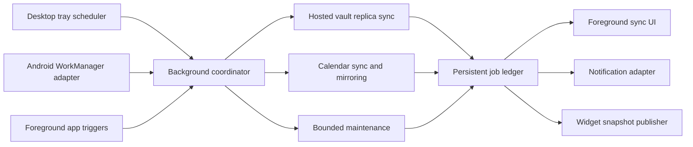

# Background Running Plan

## Summary

Collab should remain useful when its main window is closed or its Android
activity is not visible. Desktop should live in the system tray and continue
bounded synchronization work. Android should use operating-system scheduled
work for synchronization and reminder maintenance without pretending that an
application can run continuously in the background.

The implementation must share sync policy and job semantics across platforms.
Desktop lifecycle code and Android scheduling code are platform adapters around
the existing Rust replica, calendar, and hosted-session boundaries; they must
not become separate sync implementations.

## Current State

- Desktop exits with the main Tauri process and has no tray or autostart
  integration.
- Android sync is driven primarily while the foreground application is active.
- Hosted vault and calendar synchronization already expose reusable native
  operations, durable cursors, pending operations, and visible foreground
  progress.
- Phase 0 now includes a debug-only WorkManager probe that invokes Rust without
  a Tauri activity or webview. Production sync scheduling is not enabled.
- Notification delivery is not implemented. Calendar reminder scheduling
  already has a typed frontend connector and a no-op implementation.

## Progress Tracker

| Phase | Status | Goal |
| --- | --- | --- |
| 0. Lifecycle contract and feasibility | Testing | Define platform behavior, OS limits, settings, job ownership, and a small desktop/Android proof. |
| 1. Shared headless background coordinator | Not started | Run bounded sync and maintenance jobs without depending on a mounted webview. |
| 2. Desktop tray and background lifecycle | Not started | Keep the desktop process available in the tray, support hide/restore/quit, and run scheduled work. |
| 3. Android scheduled background work | Not started | Use WorkManager for durable, constrained sync and catch-up work. |
| 4. Reliability, progress, and power controls | Not started | Add locking, backoff, persisted outcomes, network/battery policy, and transparent status. |
| 5. Platform hardening and release | Not started | Validate lifecycle, packaging, upgrades, and device/desktop behavior before enabling by default. |

## Product Behavior

### Shared Settings

- `Run in background`: master switch for background work.
- `Background sync`: allow scheduled vault and calendar synchronization.
- `Sync interval`: system-managed, 15 minutes, 30 minutes, hourly, or manual
  only. Android intervals are requests, not exact promises.
- `Only on unmetered networks`: especially important for large hosted assets.
- `Pause on battery saver`: enabled by default on mobile.
- `Start at login`: desktop only and disabled by default.
- `Close button behavior`: hide to tray or quit.
- Per-server and per-vault offline-copy settings continue to determine what is
  eligible for background synchronization.

The settings UI must explain when the OS has deferred work, but it must not
claim an exact next-run time that the platform cannot guarantee.

### Desktop

- Closing the main window hides it when background running is enabled.
- The tray menu exposes Open Collab, Sync now, Pause background sync, recent
  sync state, and Quit.
- Explicit Quit terminates workers, closes live connections, and exits.
- A visible setting controls login startup. Installing the app must not silently
  enable autostart.
- Active live document sessions are not kept alive merely because the window is
  hidden. Durable synchronization may continue; interactive presence should
  stop when no document is actively open.

### Android

- Periodic work uses WorkManager with network constraints and exponential
  backoff.
- App foregrounding requests an immediate catch-up, while user-triggered Sync
  now creates expedited work where the OS permits it.
- Large user-visible uploads/downloads use an explicit foreground transfer with
  a persistent notification instead of hidden unrestricted work.
- Device reboot, app update, force-stop, Doze, battery saver, and revoked
  notification permission are treated as normal lifecycle conditions.
- Collab does not use a permanent hidden webview or an always-on foreground
  service for routine synchronization.

## Architecture

### Shared Background Coordinator

Add a native coordinator that can run without React state or a mounted webview.
It should:

- discover saved server sessions and eligible offline replicas
- run one bounded job per server/profile with a global concurrency cap
- reuse the existing server session, replica, and calendar sync code
- serialize conflicting SQLite work through the existing cached stores
- persist job start, progress summary, result, retry time, and error category
- accept cancellation and a hard runtime budget
- publish compact progress events when the foreground UI is available

The coordinator owns scheduling policy, but it does not own credentials.
Platform credential stores remain the only durable source for refresh tokens.

### Job Contract

Every job needs:

- stable job ID and idempotency key
- job kind, server URL/profile, and optional vault ID
- trigger: foreground, periodic, push invalidation, retry, or user initiated
- creation, start, finish, and next-retry timestamps
- bounded progress totals where they are knowable
- terminal outcome: succeeded, partial, deferred, authentication required,
  permission denied, conflict, cancelled, or failed
- retry classification with capped exponential backoff and jitter

Only one writer may synchronize a given server/profile/vault tuple at a time.
Foreground and background requests should join or supersede existing work
instead of racing it.

## Phase Details

### Phase 0: Lifecycle Contract And Feasibility

- [x] Document close, quit, suspend, resume, reboot, update, and force-stop
  behavior in [the Phase 0 lifecycle contract](./background-running-phase0-contract.md).
- [x] Prototype a native desktop tray without changing current quit behavior.
- [x] Prototype one Android WorkManager worker that calls a narrow native probe.
- [x] Confirm the remaining work required for session restoration without the
  webview.
- [x] Record packaging implications for AppImage, Flatpak, Windows, macOS, APK,
  and AAB builds.
- [ ] Validate the tray proof on Linux, Windows, and macOS and the WorkManager
  proof on a physical Android device.

Exit gate: both prototypes run on real target platforms and the native
coordinator boundary is agreed before production behavior changes.

### Phase 1: Shared Headless Background Coordinator

- Extract foreground-only orchestration out of React stores where necessary.
- Add typed job request/result models in a shared Rust crate or a platform-free
  Tauri module.
- Reuse vault replica and calendar sync implementations directly.
- Add the persistent job ledger and per-resource locking.
- Expose typed commands for run now, cancel, list recent outcomes, and read
  aggregate progress.

Exit gate: a native test can restore a session and complete a bounded sync
without opening a Collab webview.

### Phase 2: Desktop Tray And Background Lifecycle

- Add tray icon/menu creation and main-window show/focus behavior.
- Intercept close requests only when background running is enabled.
- Add explicit application quit handling and graceful worker shutdown.
- Add autostart integration and settings.
- Feed the existing sync menu from the persistent job ledger so hidden-window
  jobs remain visible when the app is restored.

Exit gate: close-to-tray, restore, login startup, manual sync, pause, and quit
work on Linux, Windows, and macOS without duplicate app instances.

### Phase 3: Android Scheduled Background Work

- Add WorkManager and a narrow Kotlin worker/native bridge.
- Schedule unique periodic work per signed-in profile, not per file.
- Add immediate catch-up and user-initiated sync requests.
- Reconcile jobs after boot/app update through WorkManager persistence.
- Surface authentication-required and permission failures on next foreground.
- Add foreground transfer handling for large explicit uploads/downloads.

Exit gate: a physical device syncs eligible cached content after the activity
has left the foreground and recovers cleanly after process death.

### Phase 4: Reliability, Progress, And Power Controls

- Add metered-network, charging, battery-saver, and roaming policy.
- Coalesce repeated server invalidations and avoid no-op sync loops.
- Persist last successful run, next eligible retry, and partial failures.
- Integrate background progress with the desktop and mobile sync surfaces.
- Publish notification and widget snapshots through narrow adapters.
- Add retention for completed job records and redact secrets from logs.

### Phase 5: Platform Hardening And Release

- Test suspend/resume, sleep, network transitions, credential expiry, server
  removal, replica removal, and app upgrades.
- Validate Android Doze, force-stop, reboot, low-storage, and battery
  restrictions on a physical-device matrix.
- Verify tray behavior under GNOME/KDE/Hyprland, Windows, and macOS.
- Document platform limitations and troubleshooting.
- Roll out behind an opt-in setting before considering background sync defaults.

## Security And Privacy

- Background jobs must use the same authorization checks and untrusted-TLS
  opt-in as foreground requests.
- Access and refresh tokens must never be written into the job ledger, logs,
  notifications, or widget snapshots.
- Removing a server or signing out cancels its jobs and removes any scheduling
  metadata that could reconnect it.
- Lock-screen notifications and widgets use user-selected privacy levels.
- Background work must not bypass vault read-only roles, offline-cache choices,
  storage quotas, or transfer limits.

## Test Plan

- Unit tests for coalescing, locking, backoff, cancellation, and job retention.
- Integration tests for headless session restoration and vault/calendar sync.
- Desktop tests for close/hide/restore/quit and single-instance behavior.
- Android worker tests for constraints, retries, process death, and unique work.
- Physical tests for Doze, reboot, offline-to-online recovery, and large
  foreground transfers.
- Regression tests proving foreground sync still reports progress and cannot
  race a background job.
- `pnpm exec tsc --noEmit`, focused Vitest suites, `cargo test --workspace`,
  Android debug/release builds, and `git diff --check`.

## Dependencies And Follow-On Work

- [Notification System Plan](./notification-system-plan.md) consumes job and
  reminder outcomes but does not own synchronization.
- [Mobile Widget Ideas](../mobile/mobile-widget-ideas.md) consumes compact snapshots
  produced by the background coordinator.
- [Android Companion App Plan](./android-companion-app-plan.md) Phase 7 must
  validate the lifecycle and release behavior delivered here.
