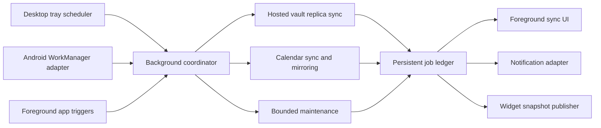

# Background Running Plan

## Summary

Collab should remain useful when its main window is closed or its Android
activity is not visible. Desktop should live in the system tray and continue
bounded synchronization work. Android should use operating-system scheduled
work for synchronization and reminder maintenance without pretending that an
application can run continuously in the background.

The implementation must share sync policy and job semantics across platforms.
Desktop lifecycle code and Android scheduling code are platform adapters around
the existing Rust replica, calendar, and hosted-session boundaries; they must
not become separate sync implementations.

## Current State

- Desktop Phase 2 provides an opt-in production tray, close-to-tray behavior,
  login startup, scheduled native synchronization, and explicit graceful quit.
- Android foreground and scheduled synchronization enter the shared native
  coordinator and persistent job ledger.
- Hosted vault and calendar synchronization already expose reusable native
  operations, durable cursors, pending operations, and visible foreground
  progress.
- Phase 3 replaces the debug-only WorkManager probe with a production worker
  that invokes Rust without a Tauri activity or webview.
- Notification delivery is not implemented. Calendar reminder scheduling
  already has a typed frontend connector and a no-op implementation.

## Progress Tracker

| Phase | Status | Goal |
| --- | --- | --- |
| 0. Lifecycle contract and feasibility | Complete | Define platform behavior, OS limits, settings, job ownership, and a small desktop/Android proof. |
| 1. Shared headless background coordinator | Complete | Run bounded sync and maintenance jobs without depending on a mounted webview. |
| 2. Desktop tray and background lifecycle | Complete | Keep the desktop process available in the tray, support hide/restore/quit, and run scheduled work. |
| 3. Android scheduled background work | Testing | Use WorkManager for durable, constrained sync and catch-up work. |
| 4. Reliability, progress, and power controls | Testing | Add locking, backoff, persisted outcomes, network/battery policy, and transparent status. |
| 5. Platform hardening and release | Testing | Validate lifecycle, packaging, upgrades, and device/desktop behavior before enabling by default. |

## Product Behavior

### Shared Settings

- `Run in background`: master switch for background work.
- `Background sync`: allow scheduled vault and calendar synchronization.
- `Sync interval`: system-managed, 15 minutes, 30 minutes, hourly, or manual
  only. Android intervals are requests, not exact promises.
- `Only on unmetered networks`: especially important for large hosted assets.
- `Pause on battery saver`: enabled by default on mobile.
- `Start at login`: desktop only and disabled by default.
- `Close button behavior`: hide to tray or quit.
- Per-server and per-vault offline-copy settings continue to determine what is
  eligible for background synchronization.

The settings UI must explain when the OS has deferred work, but it must not
claim an exact next-run time that the platform cannot guarantee.

### Desktop

- Closing the main window hides it when background running is enabled.
- The tray menu exposes Open Collab, Sync now, Pause background sync, recent
  sync state, and Quit.
- Explicit Quit terminates workers, closes live connections, and exits.
- A visible setting controls login startup. Installing the app must not silently
  enable autostart.
- Active live document sessions are not kept alive merely because the window is
  hidden. Durable synchronization may continue; interactive presence should
  stop when no document is actively open.

### Android

- Periodic work uses WorkManager with network constraints and exponential
  backoff.
- App foregrounding requests an immediate catch-up, while user-triggered Sync
  now creates expedited work where the OS permits it.
- Large user-visible uploads/downloads use an explicit foreground transfer with
  a persistent notification instead of hidden unrestricted work.
- Device reboot, app update, force-stop, Doze, battery saver, and revoked
  notification permission are treated as normal lifecycle conditions.
- Collab does not use a permanent hidden webview or an always-on foreground
  service for routine synchronization.

## Architecture

### Shared Background Coordinator

Add a native coordinator that can run without React state or a mounted webview.
It should:

- discover saved server sessions and eligible offline replicas
- run one bounded job per server/profile with a global concurrency cap
- reuse the existing server session, replica, and calendar sync code
- serialize conflicting SQLite work through the existing cached stores
- persist job start, progress summary, result, retry time, and error category
- accept cancellation and a hard runtime budget
- publish compact progress events when the foreground UI is available

The coordinator owns scheduling policy, but it does not own credentials.
Platform credential stores remain the only durable source for refresh tokens.

### Job Contract

Every job needs:

- stable job ID and idempotency key
- job kind, server URL/profile, and optional vault ID
- trigger: foreground, periodic, push invalidation, retry, or user initiated
- creation, start, finish, and next-retry timestamps
- bounded progress totals where they are knowable
- terminal outcome: succeeded, partial, deferred, authentication required,
  permission denied, conflict, cancelled, or failed
- retry classification with capped exponential backoff and jitter

Only one writer may synchronize a given server/profile/vault tuple at a time.
Foreground and background requests should join or supersede existing work
instead of racing it.

## Phase Details

### Phase 0: Lifecycle Contract And Feasibility

- [x] Document close, quit, suspend, resume, reboot, update, and force-stop
  behavior in [the Phase 0 lifecycle contract](./background-running-phase0-contract.md).
- [x] Prototype a native desktop tray without changing current quit behavior.
- [x] Prototype one Android WorkManager worker that calls a narrow native probe.
- [x] Confirm the remaining work required for session restoration without the
  webview.
- [x] Record packaging implications for AppImage, Flatpak, Windows, macOS, APK,
  and AAB builds.
- [ ] Validate the tray proof on Linux, Windows, and macOS and the WorkManager
  proof on a physical Android device.

Exit gate: both prototypes run on real target platforms and the native
coordinator boundary is agreed before production behavior changes.

### Phase 1: Shared Headless Background Coordinator

- [x] Extract foreground-only vault and calendar synchronization orchestration
  out of React stores so foreground and background requests join the same
  process-owned resource lock.
- [x] Add typed job request/result models in a platform-free
  Tauri module.
- [x] Reuse the native vault replica and calendar stores directly, including
  pending-operation replay, bounded change pages, manifest deltas, and
  offline-body maintenance.
- [x] Add the persistent job ledger, startup recovery, idempotency, bounded
  runtime, cancellation, global concurrency cap, and per-server locking.
- [x] Add a native saved-server registry and restore refresh-token sessions
  without localStorage or a webview.
- [x] Expose typed commands for run now, cancel, list recent outcomes, and read
  aggregate progress.
- [x] Add a native integration test that restores a refresh-token session and
  completes a replica delta sync against a mock server without a Tauri window.

Exit gate: a native test can restore a session and complete a bounded sync
without opening a Collab webview.

Phase 1 implementation is complete and remains in testing while foreground
vault/calendar synchronization and the Android Phase 0 probe are exercised
against real hosted servers. Phase 2 now consumes the same ledger and
coordinator from the desktop tray without mounting React.

### Phase 2: Desktop Tray And Background Lifecycle

- [x] Add tray icon/menu creation and main-window show/focus behavior.
- [x] Intercept close requests only when background running is enabled.
- [x] Add explicit application quit handling and graceful worker shutdown.
- [x] Add autostart integration and settings.
- [x] Feed the existing sync menu from the persistent job ledger so hidden-window
  jobs remain visible when the app is restored.
- [x] Prevent duplicate desktop instances and restore the existing window when a
  second launch is attempted.
- [ ] Validate close-to-tray, restore, autostart, scheduled/manual sync, pause,
  and quit on Linux, Windows, and macOS packages.

Exit gate: close-to-tray, restore, login startup, manual sync, pause, and quit
work on Linux, Windows, and macOS without duplicate app instances.

Phase 2 implementation is complete and remains in testing until the packaged
desktop behavior is exercised on Linux, Windows, and macOS. Background mode is
opt-in; existing installations retain close-means-quit until the setting is
enabled.

### Phase 3: Android Scheduled Background Work

- [x] Add WorkManager and a narrow Kotlin worker/native bridge.
- [x] Schedule unique periodic work per signed-in profile, not per file.
- [x] Add immediate catch-up and user-initiated sync requests.
- [x] Reconcile jobs after boot/app update through WorkManager persistence.
- [x] Surface authentication-required and permission failures on next foreground.
- [ ] Add foreground transfer handling for large explicit uploads/downloads.
- [ ] Validate process-death, reboot, update, retry, and sign-out behavior on a
  physical Android device.

Exit gate: a physical device syncs eligible cached content after the activity
has left the foreground and recovers cleanly after process death.

Phase 3 is in testing. `CollabBackgroundWorker` enters the Rust coordinator
directly through `CollabBackgroundBridge`, without constructing an activity or
webview. WorkManager owns one persisted periodic request per local profile plus
coalesced catch-up and expedited user requests. The mobile foreground sync path
now uses the same native job ledger, Settings exposes the opt-in interval and
recent outcomes, and authentication/permission terminal states are shown when
the app returns to the foreground. Removing the final connected server cancels
that profile's scheduled work. Large explicit transfers still need the separate
foreground-service path above.

### Phase 4: Reliability, Progress, And Power Controls

- [x] Add metered-network, charging, low-battery, and roaming policy to Android
  WorkManager constraints.
- [x] Coalesce repeated server invalidations and avoid no-op sync loops.
- [x] Persist attempts, capped exponential retry eligibility, successful runs,
  and partial failures.
- [x] Integrate background progress with the desktop and mobile sync surfaces.
- [x] Publish a compact, credential-free status snapshot through a narrow native
  adapter for later notification and widget consumers.
- [x] Add age/count retention for completed job records and redact sensitive
  failure payloads before they reach the ledger or Android worker logs.

Phase 4 implementation is complete and is now in testing. Android scheduled and
immediate work share explicit
unmetered-network, roaming, charging, and low-battery constraints. The durable
ledger records retry attempts and bounded exponential retry times, removes
terminal records after 30 days (with a 200-record hard cap), and exposes a
redacted aggregate snapshot. Desktop continues to poll detailed ledger progress
in the sync popover; mobile Settings now refreshes recent outcomes while
visible. Resource locking coalesces concurrent server invalidations, and native
vault/calendar jobs persist a structured changed count so zero-change runs do
not emit another foreground replica mutation and start a reconciliation loop.
Power and network behavior still requires the physical-device lifecycle matrix
covered by Phase 5.

### Phase 5: Platform Hardening And Release

- [x] Add automated recovery coverage for interrupted jobs, credential refresh,
  server removal, replica removal, old settings/ledger reads, and no-op
  coalescing across app upgrades.
- [x] Request a bounded coalesced catch-up when the desktop window is restored;
  keep sleep/resume handling on the monotonic native scheduler.
- [x] Defer routine Android synchronization under low-storage conditions and
  redact bounded worker errors before logging or returning output data.
- [ ] Validate Android Doze, force-stop, reboot, low-storage, and battery
  restrictions on a physical-device matrix.
- [ ] Verify tray behavior under GNOME/KDE/Hyprland, Windows, and macOS.
- [x] Document platform limitations, release checks, physical test matrices, and
  troubleshooting in
  [Background Running Release Validation](../build/background-running-release-validation.md).
- [x] Keep desktop and Android background running behind explicit opt-in
  settings; do not migrate existing users to enabled defaults.
- [ ] Add notification-backed Android foreground transfer handling for large
  explicit uploads/downloads after the notification system provides its
  persistent channel and permission flow.

Phase 5 implementation is complete and is now in testing. Automated coverage
exercises interrupted-job recovery, schema-compatible upgrades, session refresh,
server/replica removal isolation, resource coalescing, Android constraints, and
worker redaction. Desktop restore requests one coordinator catch-up, while sleep
and network recovery remain bounded by the existing monotonic scheduler and
resource locks. The remaining release gates are the packaged desktop/physical
Android matrix and the notification-dependent foreground-transfer path; neither
can be represented accurately by an in-process test.

## Security And Privacy

- Background jobs must use the same authorization checks and untrusted-TLS
  opt-in as foreground requests.
- Access and refresh tokens must never be written into the job ledger, logs,
  notifications, or widget snapshots.
- Removing a server or signing out cancels its jobs and removes any scheduling
  metadata that could reconnect it.
- Lock-screen notifications and widgets use user-selected privacy levels.
- Background work must not bypass vault read-only roles, offline-cache choices,
  storage quotas, or transfer limits.

## Test Plan

- Unit tests for coalescing, locking, backoff, cancellation, and job retention.
- Integration tests for headless session restoration and vault/calendar sync.
- Desktop tests for close/hide/restore/quit and single-instance behavior.
- Android worker tests for constraints, retries, process death, and unique work.
- Physical tests for Doze, reboot, offline-to-online recovery, and large
  foreground transfers.
- Regression tests proving foreground sync still reports progress and cannot
  race a background job.
- `pnpm exec tsc --noEmit`, focused Vitest suites, `cargo test --workspace`,
  Android debug/release builds, and `git diff --check`.

## Dependencies And Follow-On Work

- [Notification System Plan](../archive/notification-system-plan.md) consumes job and
  reminder outcomes but does not own synchronization.
- [Mobile Widget Ideas](../mobile/mobile-widget-ideas.md) consumes compact snapshots
  produced by the background coordinator.
- [Android Companion App Plan](./android-companion-app-plan.md) Phase 7 must
  validate the lifecycle and release behavior delivered here.
- [Background Running Release Validation](../build/background-running-release-validation.md)
  is the executable package/device matrix for Phase 5.
