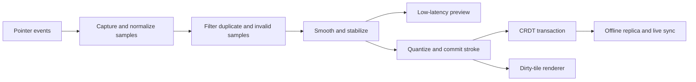
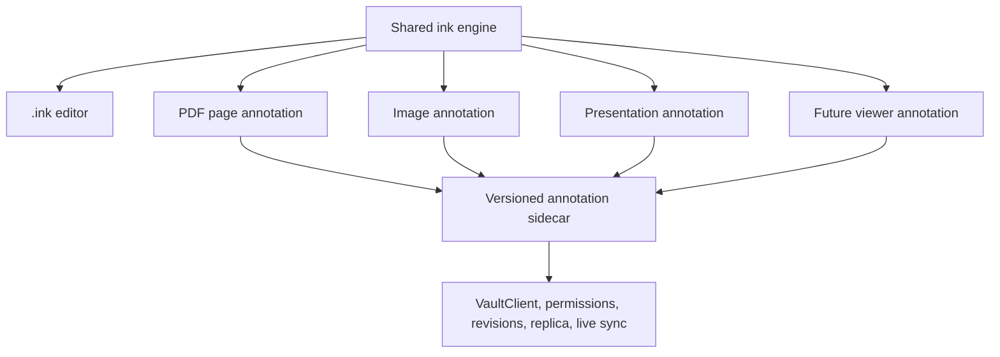

# Digital Ink And Annotation Plan

## Status

Phase 0 is complete except for its physical-device gate. Phase 1 is complete:
the shared ink domain, its Rust trust boundary, and its fixtures exist and are
tested, with no user-visible surface yet. Phases 2-11 have not started.

The frozen contract, the measured baselines, and the open device gate are in
`docs/plans/digital-ink-phase0-contract.md`.

This plan introduces first-class handwriting and drawing documents to Collab,
then reuses the same ink model, renderer, input pipeline, and tools for PDF,
image, presentation, and other document annotations.

## Summary

Add a native `.ink` vault document with:

- pressure-sensitive handwriting and drawing
- pen, stylus, touch, mouse, touchpad, and drawing-tablet input
- fixed pages and bounded infinite canvases
- extensive drawing, selection, geometry, text, layer, and page tools
- normal local and hosted vault persistence
- live collaboration and offline reconciliation
- desktop, phone, and tablet editing
- deterministic PNG, SVG, and PDF export
- source-linked exports that can be inserted into notes and reopened
- a shared annotation scene for PDFs, images, presentations, and future viewers

The feature is a new **Create** workflow, not only a viewer tool. Users should
be able to choose **New Drawing** from the command bar, Files sidebar header,
folder context menu, and normal creation dialog. This creates an ordinary
`.ink` document in the selected vault folder and opens the dedicated editor.

## Product Boundary

### Native File Type

- Extension: `.ink`
- Media type: `application/vnd.collab.ink+json`
- Document kind: `collab-ink`
- Initial schema version: `1`
- Storage: bounded, deterministic, schema-versioned JSON
- Authority: the `.ink` document, never an exported raster image

The format stores editable vector ink and objects. It must not store a PNG as
the authoritative document and must not serialize browser canvas state.

The W3C Ink Markup Language can inform sample/channel terminology and may
become an optional interchange exporter later. It should not be the native
format: Collab also needs pages, layers, objects, vault references,
collaboration identity, and deterministic product-specific migrations.

### Creation Presets

The **New Drawing** dialog should offer:

- blank page
- ruled paper
- graph paper
- dotted paper
- music staff
- storyboard
- custom fixed page
- infinite canvas

Fixed-page defaults should include A4, Letter, 4:3, and 16:9 in portrait and
landscape variants. Templates are ordinary document content and can be saved,
duplicated, imported, and shared.

### Non-Goals For The First Release

- replacing a professional raster-painting application
- arbitrary Photoshop-style filters and blend pipelines
- animation or video editing
- handwriting recognition as an implicit or destructive operation
- biometric signature verification
- editing the original bytes of a PDF by default
- silent conversion of annotations into flattened source files

## Existing Collab Groundwork

The implementation should consolidate rather than discard existing behavior:

- `ImageView` already supports additive text, arrow, and basic pen overlays.
- `PdfView` already persists shared highlights, text annotations, comments, and
  bookmarks through `PdfSidecarState`.
- PDF annotations already use `VaultClient`, optimistic versions, hosted
  permissions, document sessions, and server-side sidecars.
- Image overlays already use `DocumentSessionController`.
- Note, logic, sheet, and presentation plans use source-linked SVG/PNG exports
  that reopen their editable source.
- Hosted documents already have WebSocket/Yrs collaboration, offline replicas,
  revisions, and recovery.

The existing image-overlay v1 and PDF-sidecar data require explicit migrations
into the shared ink scene. The new engine must not leave three incompatible pen
implementations behind.

## Document Model

Phase 0 freezes the exact schema. The initial direction is:

```ts
interface InkDocument {
  kind: 'collab-ink';
  schemaVersion: 1;
  id: string;
  name: string;
  createdAt: string;
  updatedAt: string;
  settings: InkDocumentSettings;
  pages: Record<string, InkPage>;
  pageOrder: string[];
  brushes: Record<string, InkBrushPreset>;
  swatches: InkSwatch[];
  metadata?: Record<string, unknown>;
}

interface InkPage {
  id: string;
  name?: string;
  mode: 'fixed' | 'infinite';
  width: number;
  height: number;
  background: InkPageBackground;
  layers: Record<string, InkLayer>;
  layerOrder: string[];
  objects: Record<string, InkObject>;
  objectOrder: string[];
}

interface InkLayer {
  id: string;
  name: string;
  visible: boolean;
  locked: boolean;
  opacity: number;
}

type InkObject =
  | InkStroke
  | InkShape
  | InkConnector
  | InkText
  | InkImage
  | InkGroup
  | InkStamp;
```

### Coordinates And Samples

- Store geometry in bounded integer logical units, independent of CSS pixels.
- Store stroke samples in document coordinates, never viewport coordinates.
- Quantize coordinates, pressure, tilt, twist, and time deltas to documented
  integer ranges.
- Use compact arrays or bounded delta encoding inside JSON to avoid a verbose
  object per sample.
- Keep the captured samples authoritative; generated outlines and tile caches
  are derived and replaceable.
- Preserve enough pressure and orientation information to re-render a stroke
  with a compatible brush after reopen.
- Split an exceptionally long stroke into linked continuation segments at a
  deterministic sample/time limit.

Each sample may contain:

```ts
interface InkSample {
  x: number;
  y: number;
  pressure?: number;
  tiltX?: number;
  tiltY?: number;
  twist?: number;
  elapsed?: number;
}
```

Unavailable hardware channels remain absent. Mouse and touch pressure may be
simulated from velocity only when the selected brush enables it.

### Stroke Model

An `InkStroke` needs:

- stable object and author IDs
- stable layer ID
- brush kind and brush-preset snapshot
- compact source samples
- color, opacity, width, thinning, smoothing, streamline, taper, and texture
- transform and bounds
- optional continuation/group identity
- creation/update metadata
- optional semantic classification added by an explicit user action

Persist the visual brush parameters used by the stroke, not only a pointer to
a mutable global preset. Changing a favorite preset must not restyle old ink.

### Pages And Infinite Canvas

Fixed pages use explicit width/height and export naturally to images or PDF.
An infinite page still has a bounded current content extent plus hard world
limits. It must not allow unbounded coordinates, zoom, or tile allocation.

The editor stores per-device viewport state outside `.ink`:

- current page
- zoom and pan
- active tool and recent presets
- panel visibility
- current layer
- presentation/read mode

### Layers

Layers support:

- rename, reorder, duplicate, merge, hide, lock, and opacity
- object movement between layers
- background/template layers
- per-layer export visibility
- clear separation between shared document layers and personal viewer state

Blend modes beyond normal and multiply should be deferred until rendering and
export parity is proven.

## Input And Stroke Pipeline

Use the Pointer Events API as the cross-platform input boundary. It provides
one event family for pen, mouse, and touch plus pressure, contact geometry,
tilt, twist, coalesced events, and device buttons where the platform exposes
them.



### Capture Rules

- Consume `getCoalescedEvents()` when available.
- Treat predicted events as preview-only and never persist them.
- Use pointer capture so strokes terminate correctly outside the surface.
- Handle `pointercancel`, lost capture, app backgrounding, rotation, and window
  focus loss without leaving a stuck stroke.
- Keep rendering within an animation-frame budget while capture can receive
  samples at a higher device rate.
- Preserve raw-enough samples for fidelity, then simplify only within a tested
  visual tolerance.
- Never perform document serialization or network writes per pointer event.

### Device Behavior

#### Pen And Drawing Tablet

- pen tip draws
- pressure controls configured width/opacity behavior
- tilt and twist affect supported brushes
- barrel button defaults to temporary eraser or lasso
- inverted pen/eraser end activates the eraser when reported
- hover can show a brush cursor without changing the document
- desktop tablet coordinates must map correctly across monitor scaling

#### Touch

- one-finger drawing is enabled when finger drawing is selected
- otherwise one finger pans and two fingers pinch/rotate the viewport
- active pen input suppresses palm contacts within a bounded time/area policy
- palm rejection is a documented best-effort application layer; hardware and
  operating-system rejection remain authoritative when available
- toolbar controls remain reachable without resting a hand over the canvas

#### Mouse And Touchpad

- primary drag draws with simulated pressure where enabled
- wheel/pinch zoom remains anchored under the cursor
- middle button or Space+drag pans
- modifier keys constrain shapes, sample colors, or temporarily switch tools
- mouse users receive the same selection, geometry, undo, and layer features

Device-specific shortcuts are configurable and cannot change document
semantics.

## Rendering Architecture

Use a Collab-owned scene and renderer with replaceable stroke-generation
adapters:

- Canvas 2D tiled scene for the main high-volume ink layer
- retained vector document as the source of truth
- dirty-region/tile invalidation for edits
- DOM/SVG overlay for selection, handles, text editing, guides, cursors, and
  accessibility
- offscreen caches bounded by memory and device pixel ratio
- worker-assisted simplification/export where supported

Do not render every stroke as a permanent DOM/SVG node in the editor. Large
handwritten notebooks will overwhelm layout and hit testing. Do not make the
canvas bitmap authoritative.

Phase 0 should evaluate `perfect-freehand` as an MIT-licensed stroke-outline
adapter. It accepts pressure-sensitive points and produces a renderable stroke
outline. Collab-owned sample, brush, geometry, hit-test, and export types must
remain independent so the adapter can be replaced.

### Hit Testing

Maintain a bounded spatial index keyed by stable object ID. Hit testing must
account for:

- stroke width and pressure outline
- transformed groups
- shapes, connectors, text, and images
- hidden and locked layers
- zoom-independent touch target expansion
- lasso intersection and containment modes

The spatial index and tile cache are derived and rebuilt after schema migration
or recovery.

## Tool Set

The editor should expose familiar icon tools with hover/long-press labels and
contextual controls. Compact screens use a configurable bottom/side tool rail
and expandable property sheet; desktop uses a restrained toolbar plus
properties/layers panels.

### Ink Tools

- ballpoint pen
- fountain pen
- technical pen
- pencil with tilt shading
- marker
- brush
- highlighter that renders behind normal ink
- laser pointer for temporary presentation/review use
- configurable favorites

Per-tool properties:

- color and recent swatches
- width
- opacity
- pressure-to-width curve
- pressure-to-opacity curve
- smoothing
- streamline/stabilizer
- taper start/end
- texture where supported
- dashed/dotted style for technical pens
- snap/shape-recognition toggle

### Erasers

- whole-stroke eraser
- segment eraser
- object eraser
- clear current layer/page with confirmation

The first release should prefer stroke and deterministic segment erasing.
Raster-style pixel erasing is deferred unless represented as bounded,
export-compatible vector masks.

### Selection And Transform

- tap selection
- rectangular and freeform lasso
- add/remove from selection
- move, scale, rotate, duplicate, delete
- group and ungroup
- align and distribute
- change color/width/opacity
- move to layer
- lock
- copy/paste across pages and compatible Collab views
- straighten and smooth selected strokes

### Geometry And Diagramming

- straight line
- arrow and double arrow
- polyline
- rectangle and rounded rectangle
- ellipse/circle
- triangle, diamond, polygon, and star
- arc and freeform closed shape
- connector with anchor points
- fill, border, dash, arrowhead, and opacity controls
- grid, guides, snapping, angle constraints, and measurement display
- optional hold-at-end conversion from rough ink to a recognized shape

Shape recognition must always be reversible and require an explicit gesture or
setting. Original ink is retained until the conversion transaction is
committed.

### Writing And Content Tools

- text box with basic rich text and lists
- sticky note
- image/SVG insertion from the vault or device
- link to a vault file or web URL
- date/time and page-number stamps
- customizable symbol/stamp palette
- equation insertion using Collab's existing math rendering boundary
- optional handwriting-to-text command in a later phase

Recognition may propose text or math but must never replace handwriting
silently.

### Precision Tools

- ruler with drawing along its edge
- protractor and angle guide
- compass/circle guide
- coordinate/grid snapping
- eyedropper
- zoom loupe

Physical-unit accuracy is best effort unless device DPI/calibration is known.
Exports use document units, not reported screen millimeters.

### Page And Layer Tools

- add, duplicate, reorder, rename, and delete pages
- page overview and thumbnails
- change page size/orientation/background
- switch ruled/grid/dot spacing and colors
- add, duplicate, reorder, hide, lock, merge, and delete layers
- search page names and typed text
- navigate via links

### History And Recovery

- undo/redo scoped to the local user's operations
- named checkpoints through normal snapshots
- autosave and dirty/sync status in the shared status bar
- restore after app/process interruption
- conflict recovery and explicit conflicted-copy workflow

## Editor Experience

### Desktop

- first-class `InkView` in the normal tab/app shell
- page navigator on the left
- full drawing surface in the center
- compact tool rail
- contextual properties and layers on the right
- status-bar zoom, page, tool, input, save, and sync state
- detachable/fullscreen distraction-free mode

Drawing-tablet users must be able to hide most chrome and map hardware buttons
to temporary tools without needing keyboard focus.

### Phone

- canvas consumes the usable viewport
- bottom tool rail with large stable targets
- tool properties in a bottom sheet
- page/layer panels slide over the surface
- portrait and landscape layouts
- pen-first palm-safe placement
- system back closes transient panels before leaving the document

### Tablet

- adaptive two/three-pane layout
- persistent page rail where space allows
- optional floating favorite tools
- split view with a reference PDF/image and `.ink` notes where the platform
  permits

## Collaboration And Offline Model

Add an explicit `LiveDocumentKind::Ink` to the frontend, `collab-live`, server
materialization, hosted document classification, replica store, and recovery
rules.

### Durable CRDT Structure

- `Y.Map` for document, page, layer, object, brush, and metadata records
- `Y.Array` for stable page, layer, object, group, and sample-chunk ordering
- `Y.Text` for concurrently editable text objects
- one semantic transaction for each completed stroke, erase, transform, group,
  style, layer, or page operation
- stable object IDs rather than array indexes

### Live Stroke Preview

Do not append one durable CRDT update per pointer sample.

- the local unfinished stroke renders immediately
- a throttled, bounded preview travels through awareness/ephemeral presence
- remote previews expire if the peer disconnects
- pointer-up commits the simplified, quantized stroke in one transaction
- very long strokes commit bounded continuation segments
- only the durable final stroke enters revisions and offline queues

This keeps collaboration responsive without flooding WebSocket rooms or
creating huge revision/update histories.

### Merge Semantics

- strokes added by different peers merge independently
- transforming one object and adding another merge independently
- delete wins over later style/move operations on the deleted object
- segment erase creates deterministic replacement IDs and tombstones the source
- reordering layers/pages does not overwrite object edits
- concurrent text edits merge through `Y.Text`
- offline strokes survive process restart and reconcile on reconnect
- viewer permissions receive live updates but cannot mutate

Awareness includes active page, tool category, selection, cursor/laser
position, and optional viewport. It must not expose raw hardware identifiers.

## Shared Annotation Architecture

Standalone `.ink` files and annotations share `InkScene`, `InkObject`,
`InkStroke`, brush generation, hit testing, rendering, tools, clipboard, and
export. Annotation containers add anchors to an immutable source surface.



### Annotation Container

The shared sidecar direction is:

```ts
interface AnchoredInkAnnotationDocument {
  kind: 'collab-annotations';
  schemaVersion: 1;
  source: {
    stableFileId?: string;
    relativePath: string;
    contentHash?: string;
    pageCount?: number;
  };
  surfaces: Record<string, AnchoredInkSurface>;
  surfaceOrder: string[];
}

interface AnchoredInkSurface {
  id: string;
  anchor:
    | { kind: 'pdf-page'; page: number; width: number; height: number }
    | { kind: 'image'; width: number; height: number }
    | { kind: 'deck-slide'; slideId: string; width: number; height: number }
    | { kind: 'generic-frame'; frameId: string; width: number; height: number };
  scene: InkScene;
}
```

Annotations use source/page coordinates and transform with zoom, pan, rotation,
crop, and fit modes. They must never be stored in viewport pixels.

### PDFs

- preserve bookmarks, text highlights, comments, and text annotations
- add pressure ink, highlighter, erasers, shapes, arrows, stamps, and signatures
- support annotations across single, scroll, and spread layouts
- keep annotations editable and separate from original PDF bytes
- export a flattened annotated PDF copy
- optionally export selected annotations as SVG/PNG
- preserve existing `pdf.comment` and `pdf.annotate` permission boundaries
- migrate the current sidecar without losing existing content

Ink capture must remain responsive while large PDF pages render in the
background. PDF rerendering cannot block the annotation layer.

### Images

- migrate image-overlay v1 text, arrow, and pen objects into `InkScene`
- add the complete shared tool set where semantically appropriate
- keep additive annotation as the default
- export/bake an annotated image only through an explicit action
- retain a repairable editable sidecar after exporting a flattened copy
- support crop/rotation transforms without moving annotations incorrectly

Hosted image annotations need the same `VaultClient`, permissions, revisions,
offline replica, and live-session behavior as PDFs rather than a local-only
filesystem exception.

### Presentations And Other Views

- deck edit mode may embed ink objects directly on slides
- review annotations that should not alter a deck use an anchored sidecar
- presenter laser/temporary ink remains ephemeral unless explicitly saved
- future document viewers opt into the shared anchored-surface contract
- annotation support is capability-driven, not inferred ad hoc from extensions

## Export And Note Integration

### Required Exports

- PNG with scale, background, crop/selection, and transparency options
- SVG preserving vector strokes, shapes, text where portable, and embedded
  raster assets
- PDF for all or selected fixed pages
- JPEG/WebP as optional raster copies
- flattened annotated PDF/image copies

Export runs from the authoritative scene and referenced vault assets. It must
not screenshot the current viewport.

### Source-Linked Note Embeds

Users can export a page, selection, or bounded infinite-canvas region directly
into a note:

1. Choose **Insert into note**.
2. Select the open note and PNG or SVG output.
3. Save the generated asset in a stable vault location.
4. Insert note-relative Markdown carrying Collab source metadata.
5. Refresh the open note through the existing reload path.
6. Activating the rendered embed reopens the `.ink` document at the page and
   source region.

Re-export can update the stable generated asset so note links remain valid.
The exported visual is a portable fallback, while the `.ink` source stays
editable.

## Performance And Resource Bounds

Phase 0 must freeze hard limits for:

- document bytes
- pages, layers, and objects
- samples per stroke and document
- maximum stroke duration before continuation
- fixed-page and infinite-world coordinates
- group depth
- text length
- decoded image pixels and embedded asset bytes
- tile dimensions, tile count, and cache memory
- zoom range and device-pixel-ratio rendering
- awareness preview rate and bytes
- CRDT update and materialization sizes
- export dimensions, pixels, memory, and wall-clock time

Target behaviors:

- visible ink follows the pointer within one display frame under normal load
- input capture remains responsive while autosave, sync, PDF rendering, or
  export runs
- only dirty tiles rerender after local edits
- opening large documents shows a usable loading surface and progressive page
  thumbnails rather than locking the app
- low-memory mobile devices evict derived tiles without losing vector data

## Security And Privacy

- no executable scripts, arbitrary HTML, or active embedded objects
- sanitize pasted SVG and rich text
- validate all vault-relative asset references
- reject NaN, infinity, invalid pressure channels, and out-of-range geometry
- bound decompression, parsing, sample counts, and export allocation
- do not treat handwriting as biometric identity data
- do not upload handwriting for recognition without an explicit, separately
  documented opt-in
- do not persist hardware serial numbers or fingerprint drawing devices
- strip unsupported external references from exports
- keep temporary laser pointers and unfinished strokes out of durable history

## Progress Tracker

| Phase | Status | Goal |
| --- | --- | --- |
| 0. Contract and input/renderer proofs | Complete, device gate open | Freeze `.ink`, prove cross-device capture, low-latency pressure rendering, bounded storage, and deterministic export. |
| 1. Shared ink domain | Complete | Implement the schema, migrations, operations, spatial index, stroke adapter, renderer, and export scene. |
| 2. Native `.ink` lifecycle | Not started | Add New Drawing creation, vault routing, tabs, revisions, snapshots, references, status, and local/hosted persistence. |
| 3. Core desktop editor | Not started | Deliver pens, erasers, selection, transforms, pages, layers, history, clipboard, and drawing-tablet operation. |
| 4. Mobile and tablet editor | Not started | Deliver adaptive touch/pen UI, gestures, palm policy, rotation/process recovery, and physical-device validation. |
| 5. Advanced tools | Not started | Add geometry, recognition, guides, precision tools, text, images, symbols, links, and templates. |
| 6. Hosted collaboration and offline merge | Not started | Add `LiveDocumentKind::Ink`, final-stroke transactions, ephemeral previews, awareness, replica merge, and recovery. |
| 7. Export and note integration | Not started | Add PNG/SVG/PDF export, source-linked note embeds, stable re-export, progress, and cancellation. |
| 8. PDF annotation integration | Not started | Migrate PDF sidecars and add shared ink tools, live/offline editing, and flattened annotated-PDF export. |
| 9. Image and shared-view annotations | Not started | Migrate image overlays and add capability-driven annotation surfaces for images, decks, and future viewers. |
| 10. Accessibility, performance, and release hardening | Not started | Validate large files, keyboard alternatives, devices, packaging, migrations, malformed content, and collaboration soak. |
| 11. Optional recognition and interchange | Deferred | Evaluate handwriting/math recognition and optional InkML interchange without changing the native source model. |

## Phase Details

### Phase 0: Contract And Input/Renderer Proofs

Frozen in `docs/plans/digital-ink-phase0-contract.md`.

- [x] Freeze extension, MIME type, schema, coordinate units, page modes, sample
      channels, quantization, and resource limits — `src/types/ink.ts`.
- [x] Compare first-party stroke generation with an isolated `perfect-freehand`
      adapter — first-party selected; the adapter stays as the proven seam.
- [x] Prove tiled rendering with at least 10,000 representative strokes — at the
      work-model level, not yet against a real canvas.
- [x] Prove deterministic SVG output from the scene, not the viewport. PNG uses
      the same scene walk and lands in Phase 7.
- [x] Prove sample simplification/quantization stays inside a documented visual
      tolerance and materially reduces size.
- [x] Prove one completed stroke maps to one bounded collaboration transaction —
      against real Yjs.
- [x] Record latency, memory, bundle, and license findings.
- [ ] Capture Pointer Events from Android pens, Android touch, Windows
      pen/tablet, Linux drawing tablet, macOS tablet where available, mouse, and
      touchpad, and verify pressure, tilt, twist, eraser, barrel button,
      coalesced events, pointer capture, cancellation, rotation, and
      app-background behavior. Run `tools/ink-input-probe.html` on each device
      and record the findings in the contract.

Exit gate: the same fixture must draw, reopen, zoom, export, and preserve
pressure faithfully on desktop and Android without frame-long UI stalls. The
model half is proven; the device half is the open item above.

### Phase 1: Shared Ink Domain

Complete. Everything here is framework-free and has no UI; Phase 2 is the first
phase a user can see.

- [x] Framework-free `src/lib/ink/` types and operations.
- [x] `.ink` classification and bounded validation in `collab-documents`
      (`crates/collab-documents/src/ink.rs`), wired into `classify_path` and the
      shared `validate` dispatch.
- [x] Parse, normalize, migrate, validate, and deterministic serialize
      (`document.ts`). Malformed input is **repaired and reported**, not
      rejected: an object whose layer record went missing moves to the bottom
      layer rather than being dropped. Only wrong-kind, bad-schema-version, and
      limit-exceeded refuse to open.
- [x] Page/layer/object operations, each returning its own inverse
      (`operations.ts`). The inverse is captured at edit time rather than
      derived later, so an erase can restore its samples and its paint index.
- [x] Spatial indexing and hit testing (`spatialIndex.ts`), on the same tile
      grid the renderer uses, with point, rectangle, lasso, and eraser-path
      queries.
- [x] Brush/sample normalization and the stroke-outline adapter (Phase 0).
- [x] Shared scene renderer and dirty-tile cache (`renderer.ts`), written
      against a minimal `InkRenderTarget` so the paint path is testable without
      a canvas.
- [x] SVG (Phase 0) and raster (`raster.ts`) export scene adapters. Raster
      export plans and bounds-checks the output size separately from painting
      it, so an impossible export is refused before anything is allocated.
- [x] Malformed, migration, geometry, and large-document fixtures
      (`fixtureShapes.ts`), shared so later phases test one corpus.

### Phase 2: Native `.ink` Lifecycle

- Add **New Drawing** to every normal create surface.
- Add creation presets and reusable templates.
- Add file-tree icon, tab kind, deep links, duplication, history, snapshots,
  trash, search, command bar, and routing to `InkView`.
- Add loading/saving through `VaultClient` and
  `DocumentSessionController`.
- Add hosted document classification and offline replica storage.
- Add asset/reference collection and rename/move/trash rewrites.
- Persist only device-local viewport/tool state in `editorStore`/`uiStore`.
- Register save/sync/conflict state in the shared status bar.

### Phase 3: Core Desktop Editor

- Build page navigator, tiled stage, tool rail, properties, and layers panel.
- Add ballpoint, fountain, technical pen, pencil, marker, highlighter, and
  brush presets.
- Add stroke, segment, and object erasers.
- Add lasso/rectangle selection, transforms, grouping, ordering, and alignment.
- Add page and layer management.
- Add clipboard, keyboard commands, autosave, and local undo/redo.
- Add distraction-free tablet mode and configurable pen-button mappings.
- Validate mouse, touchpad, and drawing-tablet workflows.

### Phase 4: Mobile And Tablet Editor

- Build adaptive phone/tablet tool rails and property sheets.
- Add pen-versus-touch gesture arbitration and best-effort palm rejection.
- Add anchored pinch zoom, pan, page navigation, and orientation changes.
- Ensure system back dismisses tools/panels before closing the document.
- Restore unfinished-safe state after process recreation.
- Validate low-memory tile eviction and background/foreground transitions.
- Test representative Samsung S Pen, USI/MPP/AES device, generic Android touch,
  and tablet layouts where hardware is available.

### Phase 5: Advanced Tools

- Add shapes, connectors, arrows, fills, dashes, and snapping.
- Add reversible shape recognition and hold-to-straighten.
- Add text, sticky notes, images/SVG, links, stamps, and equations.
- Add ruler, protractor, compass, guides, loupe, and eyedropper.
- Add page backgrounds, document templates, brush favorites, and swatches.
- Add selection cleanup, smoothing, and recoloring.
- Keep recognition optional and non-destructive.

### Phase 6: Hosted Collaboration And Offline Merge

- Add `LiveDocumentKind::Ink` across frontend, `collab-live`, server,
  classification, materialization, replica, and recovery.
- Implement stable map/order CRDT structures and `Y.Text` text objects.
- Commit final strokes/semantic edits as bounded transactions.
- Send unfinished stroke previews through throttled awareness only.
- Add remote cursors, selections, active page, and peer colors.
- Validate concurrent add/erase/transform/reorder/text scenarios.
- Validate offline restart, reconnect merge, role enforcement, revision
  materialization, and snapshot restore on desktop and Android.

### Phase 7: Export And Note Integration

- Add PNG, SVG, and multi-page PDF export.
- Add page, selection, region, scale, crop, transparency, and background
  options.
- Run heavy exports in a worker/bounded job with progress and cancellation.
- Add **Insert into note** with source-linked stable assets.
- Reopen the `.ink` page/region when the embed is activated.
- Add stable re-export and missing-asset/font reports.
- Verify visible output in light/dark note rendering and PDF printing.

### Phase 8: PDF Annotation Integration

- Introduce the anchored ink surface in the PDF sidecar.
- Migrate current bookmarks, highlights, text annotations, and comments without
  loss.
- Add shared pens, highlighter, erasers, shapes, stamps, and selection tools.
- Keep annotation rendering independent from asynchronous PDF page rendering.
- Add live/offline annotation sessions with existing permissions.
- Export flattened annotated PDF copies without modifying source bytes.
- Validate rotation, page sizes, single/scroll/spread layouts, OCR layers, and
  large PDFs.

### Phase 9: Image And Shared-View Annotations

- Migrate `ImageOverlayDocument` v1 into the shared scene.
- Route local and hosted image annotations through `VaultClient`.
- Preserve additive mode and make destructive bake/export explicit.
- Validate crop, rotate, resize, zoom, OCR, and annotation transforms.
- Add capability-driven anchored annotations to presentation review mode.
- Document the adapter contract for future file viewers.

### Phase 10: Accessibility, Performance, And Release Hardening

- Provide keyboard alternatives for every non-freehand document operation.
- Add accessible object/layer/page names and reading order for typed content.
- Validate large notebooks, long strokes, many layers, images, and malformed
  files.
- Validate Linux, Windows, macOS, Android, drawing tablets, touch, mouse, and
  packaging channels.
- Complete memory, battery, thermal, latency, migration, encryption, and crash
  recovery testing.
- Run multi-client collaboration and offline soak tests.
- Publish supported input channels and known platform limitations.

### Phase 11: Optional Recognition And Interchange

- Evaluate on-device handwriting-to-text and handwritten-math recognition.
- Require explicit invocation, preview, and user confirmation.
- Keep original ink after conversion.
- Evaluate bounded InkML import/export as interchange only.
- Never change `.ink` authority or claim biometric/signature verification.

## Recommended Implementation Order

1. Complete Phase 0 on real desktop and Android hardware.
2. Build one shared ink domain and renderer.
3. Add first-class `.ink` creation and lifecycle.
4. Deliver a strong desktop editor.
5. Deliver phone/tablet input before claiming cross-platform handwriting.
6. Add advanced geometry and content tools.
7. Add collaboration using final-stroke transactions and ephemeral previews.
8. Complete source-linked export before viewer annotation migrations.
9. Migrate PDF and image annotations onto the proven shared engine.
10. Treat recognition and InkML interchange as separate optional work.

## Definition Of A Useful First Release

A production release is useful when a user can:

1. Create a `.ink` drawing from the normal Collab create surfaces.
2. Handwrite or draw naturally with a pen, touch, mouse, touchpad, or drawing
   tablet.
3. Organize work into pages and layers with a substantial practical tool set.
4. Edit locally, in hosted vaults, live with peers, and offline without losing
   strokes.
5. Export a page or selection as PNG/SVG and insert it into a note as a
   source-linked editable visual.
6. Annotate PDFs and images with the same familiar ink tools.
7. Export flattened annotated copies while preserving the editable sidecar and
   original source file.
