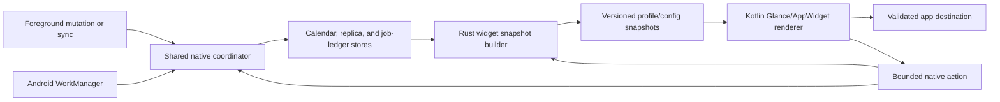

# Mobile Widgets Integration Plan

## Summary

Add the evaluated mobile widget set to the Android companion app. Widgets must
remain useful offline, render without starting the Tauri webview, preserve
Collab's profile and authorization boundaries, and refresh from the same native
calendar, replica, and background-coordinator state as the app.

The calendar agenda is the first delivery because it proves the shared snapshot,
privacy, configuration, deep-link, and lifecycle boundaries. Month calendar,
tasks, quick capture, vault shortcuts, birthday/countdown, and sync status then
reuse that foundation. iOS remains a later platform adaptation, not part of this
plan.

## Product Scope

### Committed Widgets

- **Calendar agenda**: next item at small size, today at medium size, and today
  plus tomorrow or a compact multi-day agenda at large size.
- **Month calendar**: resizable month grid with today, event-density markers,
  and day deep links.
- **Tasks**: overdue and upcoming calendar/Kanban tasks with configurable
  sources and an optional confirmed completion action.
- **Quick capture**: shortcuts into the existing new-note, new-task,
  new-calendar-item, photo, and file-import flows.
- **Vault shortcuts**: user-pinned and recent notes, boards, PDFs, and folders.
- **Birthday and countdown**: privacy-aware upcoming birthdays and selected
  event countdowns.
- **Sync status**: last successful sync, pending and action-required counts,
  offline/auth state, and a bounded Sync now action.

Calendar agenda is the default recommendation. Sync status is opt-in and aimed
at troubleshooting rather than being promoted as a general-purpose default.

### Non-Goals

- Reimplementing calendar, task, note, or file editors in a widget.
- Starting or retaining a hidden WebView to render or refresh a widget.
- Direct network requests, bearer tokens, refresh tokens, or server URLs in the
  launcher process or widget storage.
- Exact minute-by-minute countdown updates or frequent polling.
- Exposing unrestricted document bodies, chat content, or vault listings to
  Android widget hosts.
- iOS WidgetKit implementation in this delivery sequence.

## Current Integration Points

- `crates/collab-calendar` already owns profile-scoped calendar definitions,
  items, indexed bounded range queries, recurrence data, and pending operations.
- The shared background coordinator already runs foreground and Android
  WorkManager sync without React or a mounted webview.
- `CollabBackgroundWorker` already reconciles native notification state after a
  job; the widget publisher should attach at the same post-job boundary.
- Android notifications already demonstrate JNI access to profile-scoped Rust
  stores, cold-start-safe native intents, lifecycle restoration, and privacy
  reduction.
- `MainActivity` already accepts notification opens and dispatches validated
  destinations to the mobile shell. Widget destinations should extend one
  general Android app-open contract rather than create a parallel router.
- `CalendarScreen` already supports calendar-item destinations and the mobile
  calendar store already combines local and hosted cached origins.
- Hosted-vault replicas and the background job ledger already provide the
  offline document metadata and sync rollups required by later widgets.

## Architecture



### Ownership Boundary

**Shared Rust code owns:**

- bounded source selection, recurrence expansion, filtering, sorting, and
  snapshot DTO construction
- authorization-aware visibility and per-profile isolation
- privacy reduction before data crosses JNI
- stable destination and action descriptors
- task-completion validation and creation of existing calendar/Kanban pending
  operations
- snapshot schema migration, retention, and invalidation decisions
- profile-scoped configuration and snapshot persistence, bounded reads, atomic
  replacement, delete tombstones, and idempotent publication decisions

**Kotlin/Android owns:**

- Glance/AppWidget providers, launcher registration, responsive layouts, and
  Android 12+ widget styling
- mapping widget IDs to non-secret configuration IDs
- bounded reads of privacy-reduced native snapshots during widget composition
- `PendingIntent` identity, tap/action receivers, update requests, and launcher
  lifecycle callbacks
- system theme/dynamic-color adaptation, accessibility labels, and widget
  preview metadata

**The mobile React shell owns:**

- widget setup and management screens that need the app's full authenticated UI
- source pickers, privacy preferences, pinned destinations, and action opt-ins
- handling validated app-open destinations after cold or warm start
- complex creation, editing, confirmation, conflict, and recovery workflows

No widget code may read the webview's localStorage or depend on a React store
being hydrated.

## Snapshot Contract

Create a versioned native contract, for example:

```text
WidgetSnapshotEnvelope
  schemaVersion
  snapshotId
  profileIdHash
  configurationId
  kind
  generatedAt
  sourceFreshness[]
  privacy
  state: ready | empty | stale | signed-out | action-required | unavailable
  payload
```

Requirements:

- Store one atomic envelope per widget configuration, not one shared global
  payload. Android widget IDs map to opaque configuration IDs.
- Bound item counts, strings, colors, source freshness entries, and total
  serialized bytes. Truncate deterministically and mark the result.
- Persist only rendered fields and opaque destination/action descriptors; never
  persist credentials, server URLs, raw document content, attendee details, or
  unrestricted metadata.
- Treat local and hosted sources independently. A stale or signed-out hosted
  source must not remove current local data.
- Generate timestamps and date boundaries using the profile/app timezone, with
  explicit DST tests. Rendering may format them using the current device locale.
- Unknown schema versions render a safe unavailable state and request a rebuild;
  they must not crash the launcher.
- Removing an account, calendar, replica, or widget configuration atomically
  deletes or rewrites every affected snapshot.

## Privacy Model

Each configuration has a presentation level enforced before snapshot storage:

- **Full**: permitted titles, time, type, and configured source color.
- **Title only**: title and time, without source/account detail.
- **Private**: generic item types and time/counts only.
- **Hidden while locked**: render a generic locked state until Android reports
  an unlocked user; no sensitive payload should be placed in lock-screen-facing
  text as a fallback.

Quick capture labels and pinned shortcut labels follow the same rule. Sync
status uses generic account state and counts and never displays a hostname or
vault name in a privacy-reduced mode.

## Progress Tracker

| Phase | Status | Goal |
| --- | --- | --- |
| 0. Contract and Android feasibility | Complete | Glance packaging, responsive rendering, bounded Rust/JNI snapshot publication, cold/warm destinations, stock-launcher emulator checks, and the physical-device matrix pass. |
| 1. Shared snapshot and configuration foundation | Complete | The bounded Rust/native store, JNI bridge, Android configuration activity, Settings management, privacy reduction, cleanup/tombstones, idempotence, coalesced publisher hooks, and physical-device lifecycle paths are validated. |
| 2. Calendar agenda widget | Complete | The cached native calendar projection, responsive agenda rendering, source freshness, privacy-aware rows, exact header/item/add destinations, live reconfiguration, and launcher refresh behavior are validated. |
| 3. Lifecycle, refresh, and management | Testing | Event-driven refresh, stale-aware launcher updates, per-profile WorkManager fallback, lifecycle cleanup, manual refresh, and privacy-safe diagnostics are implemented; physical-device lifecycle validation remains. |
| 4. Month, birthday, and countdown widgets | Not started | Reuse calendar snapshots for month density and privacy-safe upcoming-date views. |
| 5. Tasks widget and confirmed actions | Not started | Combine calendar/Kanban tasks and route completion through existing idempotent pending-operation paths. |
| 6. Quick capture and vault shortcuts | Not started | Add validated deep links for creation, pinned content, and recent files without duplicating editors. |
| 7. Sync status widget | Not started | Expose privacy-safe native ledger rollups and a coalesced manual-sync action. |
| 8. Hardening and release | Not started | Complete automated, launcher, upgrade, privacy, battery, accessibility, and physical-device validation. |

## Phase 0: Contract And Android Feasibility

### Implementation Status

- Stable AndroidX Glance `1.1.1` and the Kotlin Compose compiler plugin are
  integrated into the generated Android project.
- A registered agenda widget renders a bounded versioned app-private JSON
  snapshot at small, medium, and large responsive breakpoints without webview or
  network access.
- A bounded Rust preview builder crosses JNI during foreground startup, initial
  widget enablement, and WorkManager completion. Kotlin validates the payload,
  fsyncs and atomically replaces the app-private snapshot, then requests a
  launcher refresh; ordinary widget composition remains file-only.
- A generalized allow-listed Android destination handoff routes agenda taps to
  the mobile Calendar screen across cold and warm activity intents.
- Kotlin snapshot tests, focused mobile routing/calendar tests, and the mobile
  TypeScript build pass.
- The universal debug APK builds with the widget resources and JNI export for
  arm64-v8a, armeabi-v7a, x86, and x86_64.
- Pixel Launcher on a Pixel 9 Pro Android 36.1 emulator discovers and binds the
  provider, renders the native snapshot at 3 x 2, resizes it to four columns
  without clipping, and retains the last snapshot while the package is force
  stopped.
- A visible agenda-row tap after normal process death starts `MainActivity`
  with the allow-listed `OPEN_DESTINATION` intent and consumes the Calendar
  route exactly once. Visible Glance text nodes carry the action explicitly
  because launcher RemoteViews do not inherit the root click consistently.
- Emulator QA also caught and fixed Glance's ten-child container limit by
  grouping each agenda item in a bounded child column; a clean refresh now
  emits no Glance or Android runtime errors.
- User-reported physical-smartphone validation completed on 2026-08-01: widget
  add, responsive resize, update, tap/deep-link, removal, process-death snapshot
  rendering, and the no-network render boundary all pass. Together with the
  stock Pixel Launcher emulator evidence above, this closes the Phase 0 exit
  criteria.

### Goals

- Add the required AndroidX Glance/AppWidget dependencies and prove they survive
  Tauri Android project regeneration and release minification.
- Render static agenda prototypes at supported launcher sizes in light, dark,
  and Android dynamic-color environments.
- Prove an app widget can read an atomic app-private snapshot without loading
  Rust or the webview during ordinary render.
- Prove a bounded JNI call can build or rebuild a snapshot from an application
  context during foreground and WorkManager execution.
- Generalize the current notification-open handoff into a validated Android
  destination contract that handles cold start, warm start, and duplicate
  intents exactly once.

### Exit Criteria

- One debug widget can be added, resized, updated, tapped, and removed on a
  physical supported Android device and at least one stock launcher emulator.
- Widget rendering after force-stopping the webview process uses the last
  snapshot and performs no network request.
- A malformed snapshot, destination, configuration ID, or intent fails closed.
- The build documentation records every native file/dependency that must survive
  `tauri android init` regeneration.

## Phase 1: Shared Snapshot And Configuration Foundation

### Implementation Status

- Collab-owned Rust DTOs now cover versioned agenda configurations, selected
  sources, display/action options, privacy levels, mixed source freshness,
  deterministic bounded items, launcher snapshots, and allow-listed action
  preparation without importing Android or Glance types.
- The profile-scoped native widget store hashes profile directory names, bounds
  every read and serialized payload, migrates the pre-envelope configuration
  array, atomically replaces files, keeps deletion tombstones so stale writes
  cannot resurrect removed widgets, cleans up profiles, and suppresses
  semantically identical publications.
- JNI exposes active-profile lookup plus configuration list/save/delete,
  build/publish, snapshot read, and action preparation with bounded input and
  redacted failures. Android launcher IDs map only to opaque configuration IDs.
- Android's widget configuration activity creates a native configuration and
  offers privacy selection. Mobile Settings lists launcher configurations and
  edits privacy, calendar sources, and item limits; configuration changes
  request an immediate native rebuild.
- The mobile shell also writes a bounded, non-sensitive native appearance
  snapshot whenever theme, accent, or interface scale changes. The standalone
  configuration activity consumes it without starting the webview and mirrors
  all four Collab themes, all six accent colors, light/dark system-bar icons,
  and the selected interface scale.
- Foreground calendar mutations, successful/failed WorkManager jobs, app
  startup/resume, widget lifecycle, package replacement, and time/timezone/
  locale broadcasts enter a per-profile coalescing publisher. Each drain and
  profile build has a hard wall-clock budget, and launcher broadcasts occur
  only when publication reports changed content.
- Eight focused Rust tests cover schema migration, size/item limits,
  deterministic ordering, privacy reduction, mixed freshness, profile cleanup
  and isolation, action allow-listing, delete-race tombstones, and idempotence.
  Five focused mobile tests, the Android app unit tests, TypeScript validation,
  Kotlin compilation, and an aarch64 compact debug APK build pass.
- Phase 1 physical-device validation is accepted complete. Testing covered the
  native configuration flow, later Settings edits, appearance integration, and
  widget lifecycle behavior on the target smartphone.

### Deliverables

- Add Collab-owned Rust widget DTOs and builders. Keep Glance and Android types
  out of shared crates.
- Add a profile-scoped native widget store under the app config/files boundary,
  with atomic replace, schema migration, bounded reads, and cleanup APIs.
- Add an Android JNI bridge for list/build/read/action preparation that follows
  the existing notification/background error-redaction pattern.
- Store widget configuration in native app storage, including widget kind,
  selected source IDs, privacy, display options, and optional action enablement.
- Add configuration screens launched from Android's widget configuration
  activity and reachable later from mobile Settings.
- Publish snapshots after relevant foreground calendar/replica mutations, after
  coordinator jobs, after time/timezone/locale change, after configuration
  changes, and when the app resumes with stale data.
- Coalesce publish requests by profile/configuration and impose a hard runtime
  budget; snapshot generation must join or follow conflicting coordinator work.

### Tests And Exit Criteria

- Unit tests cover schema versions, size and item limits, deterministic ordering,
  privacy reduction, mixed fresh/stale sources, and account removal.
- Concurrent publish/configure/delete operations cannot resurrect removed data
  or expose another profile's snapshot.
- Repeated identical publication is idempotent and does not continually wake
  the launcher.

## Phase 2: Calendar Agenda Widget

### Implementation Status

- `collab-calendar` now owns the bounded Rust recurrence projection shared by
  native widget consumers. It expands RFC 5545 rules and RDATE/EXDATE values,
  preserves calendar wall time across DST, applies active recurrence
  exceptions, projects birthdays, filters deleted items, and deterministically
  bounds and sorts results. Kotlin does not interpret recurrence rules.
- The Android publisher now reads cached profile calendar definitions, bounded
  range candidates, hosted/subscription freshness, and each widget's selected
  sources. It excludes archived/deleted calendars, applies the mobile declined
  preference, completed-task visibility, app timezone and 12/24-hour setting,
  and emits explicit overdue/today/upcoming sections.
- Privacy reduction persists only permitted titles, time labels, source colors,
  and validated calendar destinations. Title-only/private modes retain a useful
  time label without persisting source names; one unavailable hosted source does
  not remove usable local rows.
- Glance renders one next item at small height, a bounded current-day agenda at
  medium height, and sectioned multi-day rows at large height. The header opens
  Today, `+` opens the existing creator on the displayed date, and enabled item
  rows carry allow-listed exact calendar-item destinations through cold/warm
  app routing.
- Launcher snapshots carry the validated app theme, accent, and interface scale,
  so appearance-only changes republish immediately. The add control has a larger
  accent-colored touch target, upcoming tasks include their date, configuration
  saves are serialized per widget, and tall launchers can render up to ten rows.
- Android now requires configuration before first placement, reconfiguration
  updates the widget's existing configuration instead of creating an orphan,
  Settings exposes only launcher-bound configurations, and successful native
  publication calls Glance's direct update API. The setup action is labelled
  `Apply`, and the agenda add control is right-aligned.
- Setup now withholds Android's successful configuration result until the real
  calendar snapshot has been published and the exact widget instance updated;
  publication failures remain in the dialog. Later in-app configuration saves
  likewise await snapshot publication and launcher refresh before reporting
  success, instead of handing that work to an error-swallowing queue.
- Launcher refresh now drives both Glance's direct update and an explicit,
  component-targeted `ACTION_APPWIDGET_UPDATE` after durable publication. This
  covers OEM launchers that retain the Phase 0 `RemoteViews` until the provider
  lifecycle is dispatched even though Glance accepted an in-process update.
- Because configuration is mandatory, `onEnabled` no longer publishes the
  Phase 0 preview before the configuration activity has created its binding.
  Android keeps the static loading layout during setup, then the successful
  Apply path performs the first Glance composition from the real snapshot.
- The agenda composable no longer captures a native file snapshot outside
  `provideContent`. Each bound instance stores its validated snapshot in
  `PreferencesGlanceStateDefinition`, renders it through `currentState`, and
  updates that state before requesting new `RemoteViews`. Live settings and
  calendar publications therefore invalidate the existing composition without
  requiring the Android process to restart.
- The shared calendar suite, focused Rust widget tests, all 148 mobile tests,
  Android app unit tests, TypeScript, crate-boundary validation, and an arm64
  debug APK build pass. The APK contains only `arm64-v8a` and verifies with APK
  Signature Scheme v2.
- Phase 2 physical-device validation is accepted complete. Clean installation,
  server login, initial placement, resizing, live settings changes, app
  backgrounding/closure, restart behavior, and calendar-driven refresh were
  exercised on the target smartphone. The final observable Glance-state fix
  eliminated the process-restart dependency and made later changes visible.

### Data Selection

- Use bounded calendar-store range queries and the existing recurrence rules;
  do not copy recurrence logic into Kotlin.
- Respect archived/deleted calendars, declined-invitation preference, completed
  task visibility, selected local/hosted sources, timezone, and all-day rules.
- Include source-specific freshness so one offline server degrades only its own
  rows.
- Produce explicit sections for overdue, today, and tomorrow/next days rather
  than making Kotlin infer calendar semantics.

### Rendering And Interaction

- Small: date, next relevant item, freshness indicator.
- Medium: today's bounded agenda with time/all-day/type/color states.
- Large: today plus tomorrow or a compact configurable multi-day horizon.
- Header opens Today; item opens the exact calendar item; add opens the existing
  calendar-item creator with a preselected date.
- Empty, stale, signed-out-source, and action-required states remain useful and
  tappable without presenting cached data as current.

### Exit Criteria

- Local-only, hosted-only, and mixed-source profiles render correctly offline.
- Recurring, multi-day, all-day, overdue, completed, birthday, and DST-boundary
  items match the mobile Calendar screen for the same configuration.
- Cold-start item/header/add destinations arrive at the intended mobile view
  once, including after process death.

## Phase 3: Lifecycle, Refresh, And Management

### Implementation Status

- Android widget updates now enter one coordinator from launcher `onUpdate`,
  foreground resume, background-job completion/failure, boot, app replacement,
  time/timezone/locale changes, and user unlock. Broadcast receivers hand work
  off with `goAsync`; they never perform native publication on the main thread.
- `onUpdate` first renders the last durable per-widget Glance state, then queues
  one unique per-profile native refresh only when the bound snapshot is missing,
  older than 30 minutes, or implausibly future-dated.
- Provider-originated updates never emit another `APPWIDGET_UPDATE` broadcast.
  External publications retain the targeted OEM-launcher notification without
  creating a recursive receiver loop during placement or reconfiguration.
- The Glance receiver remains the sole owner of its broadcast `PendingResult`;
  the additional coordinator work is dispatched without a second `goAsync`
  call, avoiding a null-result crash after widget placement.
- One unique 30-minute WorkManager chain per bound profile provides a coarse
  cached-data publication fallback. It performs no network request and never
  creates per-widget jobs; normal background calendar sync continues to use the
  existing shared background coordinator and triggers publication on completion.
- Periodic work is reconciled from launcher bindings at setup, update,
  foreground resume, and removal. Profile cleanup cancels matching widget work,
  deletes profile-scoped configurations, snapshots, and diagnostics, and
  refreshes any remaining launcher instances.
- The Mobile Settings management surface now shows every bound configuration,
  source/privacy controls, last successful update, error state, item count,
  serialized size, generation duration, truncation, and stale/unavailable source
  counts. It offers a manual refresh and explains launcher-owned removal; inline
  configuration edits continue to apply live.
- Diagnostics are native, bounded, profile/configuration scoped, and contain no
  titles, source names, server URLs, or destinations. Failed refreshes retain the
  last-success timestamp and publish only a generic recovery message.
- Focused Rust widget tests, all 149 mobile tests, Android widget unit tests,
  TypeScript validation, and Rust crate-boundary validation pass.
- Remaining Phase 3 exit work is physical-device validation across reboot,
  package replacement, manual clock/timezone/locale changes, user unlock,
  launcher refresh, periodic fallback, removal, and manual-refresh/error states.

- Add one update coordinator that accepts foreground changes, background-job
  completion, Android `onUpdate`, boot, app replacement, time/timezone/locale
  change, user unlock, and manual refresh.
- Use event-driven publication first. Periodic WorkManager is a coarse
  OS-controlled freshness fallback and must not create per-widget network jobs.
- `onUpdate` renders the last snapshot immediately and schedules coalesced native
  work only when stale; it never blocks the broadcast receiver.
- Add a mobile widget-management surface showing configurations, source/privacy
  summaries, last update, errors, refresh, reconfigure, and remove guidance.
- Cancel configuration work and delete data on widget removal, account removal,
  replica removal, profile reset, or app data reset.
- Add privacy-safe diagnostics for generation duration, serialized size,
  truncation, update cause, and freshness without logging titles or destinations.

## Phase 4: Month, Birthday, And Countdown Widgets

### Month Calendar

- Generate day-level density/count/color summaries in Rust; Kotlin renders the
  responsive grid.
- Tapping a day opens that day in the existing Calendar screen.
- Small sizes may show the current month and markers only; larger sizes may show
  a short selected-day agenda without embedding full item bodies.

### Birthday And Countdown

- Select birthdays and explicitly user-selected countdown-capable events from
  the same calendar snapshot boundary.
- Update day-based countdowns when the date changes; do not schedule minute-level
  work solely for countdown text.
- Apply the configuration privacy level before persisting names or titles.

## Phase 5: Tasks Widget And Confirmed Actions

- Define one shared task projection across calendar tasks and cached Kanban
  assignments, with stable source/item identity, due state, completion state,
  capability, and freshness.
- Filter by calendar, server/account, vault, board, assignee, and due horizon
  using opaque native configuration references.
- A task tap opens its real Calendar or Kanban surface.
- Completion must require a native confirmation or open the app to confirm; no
  launcher tap may silently mutate shared data.
- After confirmation, Rust revalidates current authorization, read-only state,
  item revision/capability, and source availability, then writes through the
  existing calendar or replica pending-operation path with a stable idempotency
  key.
- Optimistically changing widget state is allowed only after the native queue
  accepts the operation. Conflicts and authorization failures remain visible in
  the app and the snapshot returns to authoritative state.

## Phase 6: Quick Capture And Vault Shortcuts

### Quick Capture

- Add destinations for new note, new task, new calendar event, photo capture,
  and file selection.
- All actions open the existing mobile flow. The widget never requests storage,
  camera, or account permissions itself and never writes draft content.
- If a destination requires a vault/calendar choice, open the app's normal
  picker with only validated hints.

### Vault Shortcuts

- Allow explicit pins for supported notes, Kanban boards, PDFs, and folders.
- Offer recent files only from native bounded replica metadata; exclude deleted,
  trashed, unavailable, and no-longer-authorized entries at publication time.
- Resolve every tap by stable server/vault/file identity in native/app routing,
  not by accepting an arbitrary path or URL from an intent.
- Missing or revoked targets open a safe recovery surface and trigger snapshot
  cleanup.

## Phase 7: Sync Status Widget

- Build privacy-safe rollups from the persistent background ledger and replica
  state: last success, running state, pending count, recoverable failures, auth
  required, and offline state.
- Aggregate by selected profile or account without storing/displaying server URLs.
- Sync now enqueues the existing unique/coalesced coordinator work. Repeated taps
  cannot create parallel work or bypass Android constraints.
- Running progress is coarse and bounded; do not turn ledger polling into a
  high-frequency widget refresh loop.
- Action-required states deep-link to the existing background/account recovery
  settings.

## Phase 8: Hardening And Release

### Automated Validation

- Rust unit/integration tests for every snapshot builder, privacy mode, source
  filter, action validator, migration, and cleanup path.
- Kotlin tests for configuration mapping, atomic reads, receiver/action intent
  validation, PendingIntent uniqueness, responsive layout selection, and update
  coalescing.
- Mobile frontend tests for every destination, setup/management path, and
  missing-target recovery.
- Regression tests proving notification alarms, WorkManager, foreground sync,
  and widgets share coordinator/store access without races.
- `pnpm exec tsc --noEmit`, focused Vitest suites, `cargo test --workspace`,
  Android debug/release builds, lint, and `git diff --check`.

### Physical And Launcher Matrix

- Supported minimum Android version plus current Android release.
- Pixel Launcher and at least one major OEM launcher; record behavior on launchers
  that do not support every resize or dynamic-color feature.
- Add, resize, reconfigure, duplicate, remove, restore-from-backup behavior,
  launcher restart, process death, force-stop, reboot, app update, and profile
  removal.
- Offline-to-online, signed-out hosted source plus local source, Doze, battery
  saver, background restriction, low storage, timezone/DST, locale/12-24-hour
  changes, and locked/unlocked privacy behavior.
- TalkBack labels, minimum touch targets, font scaling, contrast, light/dark
  themes, and truncation at every supported size.
- Battery and wakeup measurements demonstrating no per-widget polling and no
  hidden webview startup.

### Release Gates

- The background-running physical-device validation must be complete enough to
  trust coordinator outcomes used by widgets.
- No widget snapshot, log, backup, intent, or Android preview contains a token,
  server URL, unapproved private title, or document body.
- Widget data is removed on account/profile deletion and does not reappear after
  boot, app update, retry, or stale WorkManager completion.
- Every widget remains coherent with stale cached data and gives the user an
  honest last-updated or action-required state.
- Play release documentation covers widget declarations, backup/data handling,
  screenshots, privacy disclosures, and launcher-specific limitations.

## Dependency Order

1. Complete the remaining background-running packaged/physical Android matrix
   that validates coordinator lifecycle behavior.
2. Phase 0 is complete; begin the shared foundation without waiting for
   unrelated mobile feature expansion.
3. Build the shared foundation and agenda through Phases 1-3.
4. Add read-only calendar-derived widgets in Phase 4.
5. Add mutation only after the task confirmation/idempotency boundary in Phase 5
   is proven.
6. Add deep-link-only capture/shortcut widgets, then the operational sync widget.
7. Run the combined hardening matrix before promoting widgets in the Play build.

Phases 4 and 6 may proceed in parallel after Phase 3 because both are read-only
consumers of the stable snapshot/destination contract. Phases 5 and 7 must reuse
the coordinator and pending-operation paths and must not introduce widget-only
synchronization.

## Documentation Updates During Implementation

- Keep this phase tracker truthful after automated and physical validation.
- Update `docs/mobile/android-companion-build.md` for native regeneration and
  dependencies.
- Add a widget release-validation matrix under `docs/build/` before Phase 8.
- Archive the original idea catalog only after every accepted idea is represented
  here and the integration plan is the canonical reference.

## Related Documents

- [Mobile Widget Ideas](../mobile/mobile-widget-ideas.md)
- [Background Running Plan](./background-running-plan.md)
- [Background Running Release Validation](../build/background-running-release-validation.md)
- [Android Companion App Plan](./android-companion-app-plan.md)
- [Notification System Plan](../archive/notification-system-plan.md)
- [User Calendar Feature Plan](./user-calendar-feature-plan.md)
