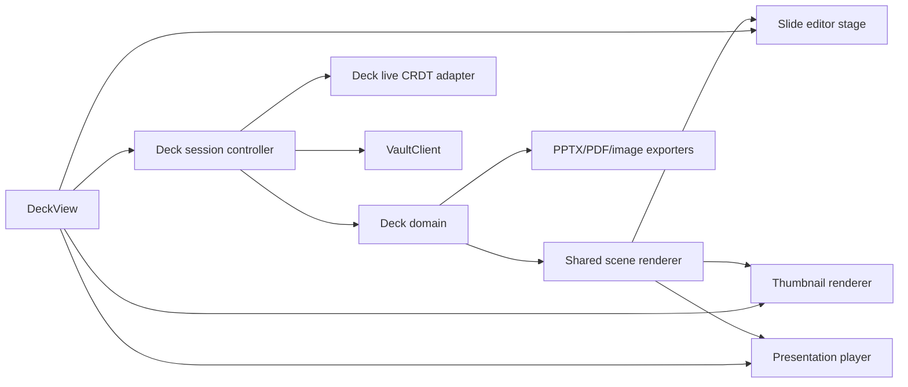

# Collab Presentations Plan

## Status

Proposed. No implementation has started.

This plan defines a first-party presentation editor for Collab. It follows the
same product boundary as Advanced Tables: Collab owns the editable document
format, editor behavior, collaboration semantics, and rendering model.
PowerPoint files are generated interoperability copies, not the live backing
format.

## Summary

Add a native `.deck` vault document with a dedicated desktop editor,
presentation mode, speaker notes, live hosted collaboration, offline copies,
mobile viewing, PDF/image export, and compatible `.pptx` export.

The first useful version should cover the normal academic and technical
presentation workflow:

- slide creation, duplication, deletion, sections, and reordering
- themes, masters, layouts, placeholders, and reusable templates
- text boxes with structured rich text, lists, links, and speaker notes
- shapes, lines, arrows, images, SVG, tables, and basic charts
- alignment, distribution, snapping, grouping, locking, and z-order
- presentation mode with keyboard, touch, and presenter controls
- local/hosted vault persistence, revisions, live editing, and offline merge
- deterministic PDF/image output and a documented `.pptx` export boundary

`.pptx` import is intentionally deferred. It is substantially harder to make
honest and safe than export, and it is not required for the first production
release.

## Difficulty Assessment

This is harder than the spreadsheet integration.

Advanced Tables has one especially difficult computational subsystem
(formulas/recalculation) and one difficult renderer (the virtualized grid).
Presentations combine several difficult interactive systems:

- rich-text editing and text layout inside transformed boxes
- a vector scene editor with resize, rotate, group, snap, and z-order behavior
- master/layout inheritance and theme resolution
- consistent rendering across editor, thumbnails, playback, PDF, images, and
  PowerPoint export
- media loading, font availability, and asset portability
- presentation playback, transitions, animation sequencing, and speaker notes
- fine-grained collaboration for both objects and text

The largest risk is not drawing rectangles. It is preserving text wrapping,
layout, fonts, and object geometry consistently across platforms and in an
exported PowerPoint file.

Rough effort for one experienced engineer:

| Scope                                            | Estimate              |
| ------------------------------------------------ | --------------------- |
| Phase 0 proofs and frozen contract               | 2-4 weeks             |
| Native desktop MVP through presentation mode     | 12-18 weeks           |
| Collaboration, offline behavior, and PPTX export | 8-14 weeks            |
| Mobile viewer and release hardening              | 6-10 weeks            |
| Deferred bounded PPTX import                     | Additional 8-16 weeks |

These are engineering estimates, not release dates. Text fidelity and physical
PowerPoint/LibreOffice/Google Slides validation can move them materially.

## Product Contract

### Native File Type

- Extension: `.deck`
- Media type: `application/vnd.collab.deck+json`
- Document kind: `collab-deck`
- Initial schema version: `1`
- Storage: bounded, schema-versioned structured JSON
- One file represents one presentation with one or more slides

`.slides` is not recommended because it is strongly associated with Google
Slides in user-facing language. `.presentation` is verbose. `.deck` is short,
descriptive, and does not imply that Collab edits PowerPoint files in place.

### Authority And Conversion

- `.deck` is always the authoritative editable source.
- `.pptx`, PDF, SVG, PNG, and handout files are generated copies.
- Export never changes the open document's backing format.
- Unsupported export features are flattened, omitted, or approximated with a
  visible report; they are never silently claimed as compatible.
- Importing `.pptx` later creates a new `.deck` and preserves the source file
  unchanged.

PowerPoint's `.pptx` format is an OOXML package containing separate
presentation, slide, master, layout, theme, relationship, notes, and media
parts. Collab should not reproduce that package structure in `.deck`; it is an
interchange concern handled only by the exporter/importer boundary.

## Initial Schema Direction

Phase 0 freezes the exact types, but the schema should use stable IDs and maps
rather than index-addressed nested arrays:

```ts
interface DeckDocument {
  kind: 'collab-deck';
  schemaVersion: 1;
  id: string;
  name: string;
  createdAt: string;
  updatedAt: string;
  size: DeckSize;
  themeId: string;
  themes: Record<string, DeckTheme>;
  masters: Record<string, DeckMaster>;
  layouts: Record<string, DeckLayout>;
  slides: Record<string, DeckSlide>;
  slideOrder: string[];
  sections?: DeckSection[];
  metadata?: Record<string, unknown>;
}

interface DeckSlide {
  id: string;
  name?: string;
  layoutId?: string;
  hidden?: boolean;
  background?: DeckFill;
  elements: Record<string, DeckElement>;
  elementOrder: string[];
  speakerNotes?: DeckRichText;
  transition?: DeckTransition;
  animations?: DeckAnimation[];
}

type DeckElement =
  | DeckTextElement
  | DeckShapeElement
  | DeckLineElement
  | DeckImageElement
  | DeckTableElement
  | DeckChartElement
  | DeckGroupElement
  | DeckEmbedElement;
```

### Coordinate Model

- Store slide geometry as bounded integer logical units, not CSS pixels.
- Default slide ratio is widescreen 16:9.
- Permit documented standard ratios and explicit custom sizes.
- Store font sizes in points and rotation in normalized degrees.
- Convert logical units to CSS pixels for editing and to English Metric Units
  only inside the PPTX exporter.
- Use one geometry implementation for hit testing, handles, snapping, playback,
  thumbnails, and export.

Integer geometry avoids collaborative floating-point drift and makes
deterministic serialization practical.

### Stable Identity

Slides, sections, elements, groups, paragraphs, animation steps, theme tokens,
masters, and layouts need stable IDs.

Stable IDs are required for:

- concurrent edits to different objects
- slide and object reordering
- comments and presence
- source-linked note embeds
- animation targets
- master/layout inheritance
- reference rewrites
- deterministic undo/redo and recovery

### Rich Text

Stored text must be a Collab-owned paragraph/run model, not HTML and not a
third-party editor's serialized state.

It should support:

- paragraphs with stable IDs
- text runs with font, size, weight, style, color, decoration, and language
- bullet/numbered lists with bounded nesting
- alignment, indentation, line spacing, and paragraph spacing
- links and explicit soft/hard breaks
- theme font/color references with explicit local overrides
- auto-fit policy: none, shrink text, or grow box

Phase 0 should evaluate Lexical as an editing adapter. It is MIT licensed,
React-compatible, accessible, and has Yjs support, but Lexical state must not
become the `.deck` schema. A smaller first-party `contenteditable` adapter
remains viable if the proof shows that Lexical introduces more state
synchronization complexity than it removes.

### Themes, Masters, And Layouts

Theme and layout behavior must be built early, not added after slide editing:

- theme color and font tokens
- slide background defaults
- slide masters
- named layouts
- placeholders with type and stable identity
- inherited objects with explicit override records
- header/footer/date/slide-number placeholders

The Collab application theme controls editor chrome only. A deck's visual theme
is document content and must render identically in dark, light, warm, and
midnight application themes.

### Assets

Images, video, audio, SVG, and other binary content remain normal vault assets.
A deck element stores a vault-relative reference plus stable metadata such as
media type, intrinsic dimensions, content hash, alt text, and crop.

- Hosted/offline opening must prefetch or resolve required assets through
  `VaultClient` and the replica.
- Rename/move/trash reference analysis must include `.deck`.
- PPTX/PDF/package export embeds the required asset bytes.
- Remote URL media is not authoritative. It must be explicitly imported or
  represented by a safe static preview plus link.
- Missing assets render a stable placeholder and remain repairable.

## Renderer And Editor Architecture



### Rendering Split

Use a fixed-aspect slide stage with a logical coordinate transform:

- DOM/SVG scene layer for visible slide objects
- SVG path layer for shapes, lines, connectors, and selection guides
- DOM text layer for accurate editing, selection, IME, and accessibility
- independent transform overlay for selection bounds, resize, rotate, crop,
  alignment, and snapping handles
- viewport virtualization for slide thumbnails and large decks

Do not render the entire editor as one canvas. Canvas-only text editing and
accessibility would create avoidable problems. Do not use one independent React
state owner per element; the scene should subscribe to normalized document
state and render stable object components.

### Shared Scene Renderer

Editor, thumbnails, presentation mode, image export, and print/PDF must consume
the same resolved slide scene. They may use different output adapters, but
layout resolution cannot be forked.

The resolver owns:

- master/layout inheritance
- theme token resolution
- object transforms and group transforms
- crop and clipping
- z-order
- text box geometry and auto-fit decisions
- connector anchors
- table and chart bounds
- animation base/final states

### Editing Interactions

The desktop editor should provide:

- left slide/section navigator
- central slide stage
- compact context-sensitive toolbar
- right properties/animation panel
- notes area below the stage
- zoom, fit, rulers, guides, grid, and snapping
- keyboard movement, resize, duplicate, group, order, and text-edit commands
- multi-select, marquee select, align, distribute, lock, group, and ungroup
- paste from clipboard as text, image, SVG, or bounded sanitized rich content

The first screen is the editor, not a landing page or template advertisement.

## Collaboration And Offline Model

The generic `useLiveJsonDocumentSession` is a useful starting point for slide
and object structure because stable-ID object arrays already reconcile
independently. It is not sufficient for concurrent editing inside the same text
run because primitive strings are replaced atomically.

The production collaboration model should add a deck-specific live codec:

- `Y.Map` for document, theme, slide, and element records
- `Y.Array` for stable ordered slide, element, paragraph, and animation IDs
- `Y.Text` with formatting attributes for paragraph/run content
- semantic transactions for move, resize, style, grouping, layout, and
  animation operations
- awareness for active slide, selected elements, text cursor, and presenter
  state
- local undo scoped to the user's transaction origins

`collab-live` and server materialization need an explicit `Deck` document kind
that converts this live structure into normalized `.deck` JSON revisions. The
normal live WebSocket ticket, state-vector handshake, backend-proxied socket,
offline replica, reconnect merge, and revision materialization paths remain
authoritative.

Required concurrent behavior:

- users editing different slides merge independently
- users editing different objects on one slide merge independently
- concurrent text edits in one text box merge at text-operation granularity
- move/resize versus delete produces a deterministic visible result
- reordering does not lose concurrent property edits
- offline edits survive restart and reconcile on reconnect
- viewer-role users can observe but cannot mutate
- live state materializes to ordinary `.deck` JSON for history, export, and
  non-live readers

## PowerPoint Export Contract

Compatible `.pptx` export is a release requirement, not an optional final idea.

### Recommended Boundary

Phase 0 should prove PptxGenJS behind a Collab-owned adapter. It is MIT
licensed, supports browser/React/Vite use, and can generate OOXML presentations
containing text, shapes, images, tables, charts, and slide masters. It can
return an `ArrayBuffer`/`Blob`, which fits the existing native save-dialog and
download boundary.

The dependency must remain isolated under a module such as:

```text
src/lib/deck/pptx/
  exportDeckToPptx.ts
  mapTheme.ts
  mapText.ts
  mapShapes.ts
  mapTables.ts
  mapCharts.ts
  exportReport.ts
```

PptxGenJS types must not leak into `DeckDocument`, the editor, collaboration
operations, or the shared scene model. The exporter should be lazy-loaded.

### Required First Export Matrix

The production export gate should cover:

- standard and custom slide sizes
- slide order, hidden slides where supported, titles, and sections where
  practical
- themes, master/layout mapping, backgrounds, and placeholders
- rich text, lists, links, alignment, spacing, and common font styles
- shapes, fills, borders, opacity, lines, arrows, and rotation
- raster images, SVG with tested fallback, crop, and transparency
- basic tables and charts
- speaker notes if the Phase 0 exporter proof confirms reliable support
- slide numbers and common footer placeholders

Initially flattened or omitted with an explicit report:

- unsupported custom geometry
- filters/blend modes not representable in DrawingML
- Collab source links and internal metadata
- unsupported fonts
- complex chart features
- video/audio features not proven portable
- animations/transitions outside the tested export subset

### Compatibility Validation

Every release must test generated files in:

- current Microsoft PowerPoint desktop
- current LibreOffice Impress
- current Google Slides import
- Apple Keynote when a macOS validation machine is available

Tests compare visible semantics, not ZIP bytes:

- slide count/order/size
- text content and wrapping tolerances
- element bounds, rotation, and z-order
- theme colors/fonts and fallbacks
- image crop and transparency
- table/chart values
- notes and links where supported

The UI shows an export report before or after save with exported, approximated,
flattened, omitted, and missing-font/asset counts.

## PDF, Image, And Note Integration

- Export the full deck or selected slides to PDF.
- Export a slide as PNG and SVG where all content is representable.
- Insert a selected slide into a note as a source-linked SVG/PNG snapshot.
- Activating that embed reopens the `.deck` at the source slide.
- Re-export can replace a stable generated asset so note links stay current.
- Export printable handouts with configurable slides per page and optional
  speaker notes.
- Link presentation tables/charts to explicit `.sheet` snapshots or stable
  ranges, with manual refresh and a persisted static fallback.

## Presentation And Presenter Modes

Presentation mode needs:

- fullscreen slide playback
- next/previous and direct slide navigation
- keyboard, mouse, touch, and remote-command handling
- black/white screen, laser pointer, and temporary ink
- slide progress and optional timer
- presenter view with current slide, next slide, notes, and elapsed time
- deterministic recovery if the presenter window closes or display topology
  changes
- reduced-motion behavior

Temporary ink, pointer position, and presenter state are ephemeral and must not
mutate the deck unless the user explicitly saves annotations.

## Mobile Scope

Mobile begins as a viewer and presentation companion:

- open local/offline hosted `.deck` copies
- responsive slide list and fit-to-screen viewer
- pinch zoom and pan
- speaker notes
- presentation navigation and optional remote-control mode
- comments and bounded text correction later

Full slide composition on a phone is not an initial goal. Tablet editing can be
evaluated after the desktop editor and mobile viewer are stable.

## Security And Resource Bounds

Phase 0 must freeze limits for:

- document bytes
- slides, masters, layouts, themes, and sections
- elements and text per slide/deck
- group depth and transform complexity
- image dimensions and decoded pixel budgets
- table rows/columns/cells
- chart series/points
- animation count and duration
- clipboard/import payload bytes
- export memory and wall-clock time

Security requirements:

- no macros, scripts, arbitrary HTML, or executable embedded objects
- no implicit network fetches
- sanitize pasted HTML and SVG
- validate vault-relative asset references
- bound archive, XML, relationship, and decompression processing for future
  PPTX import
- reject cyclic master/layout/group references
- reject NaN, infinite, or out-of-range geometry
- treat fonts and media as untrusted inputs
- perform export in a worker or bounded native job so the UI stays responsive

## Progress Tracker

| Phase                                                 | Status      | Goal                                                                                                                |
| ----------------------------------------------------- | ----------- | ------------------------------------------------------------------------------------------------------------------- |
| 0. Product contract and technical proofs              | Not started | Freeze `.deck`, prove scene/text fidelity, rich-text editing, live text collaboration, and PPTX export.             |
| 1. `.deck` domain and vault integration               | Not started | Add schema, validation, migrations, creation, routing, references, revisions, and normal local/hosted lifecycle.    |
| 2. Desktop scene editor foundation                    | Not started | Build slide navigation, stage rendering, selection, transforms, snapping, ordering, clipboard, and undo/redo.       |
| 3. Rich text, themes, masters, and layouts            | Not started | Deliver text editing, placeholders, theme inheritance, reusable layouts, and templates.                             |
| 4. Visual objects and Collab data integration         | Not started | Add images, SVG, shapes, lines, groups, tables, charts, `.sheet` snapshots, and note links.                         |
| 5. Presentation mode and speaker workflow             | Not started | Add fullscreen playback, notes, presenter view, navigation, handouts, and PDF/image output.                         |
| 6. Hosted collaboration and offline behavior          | Not started | Add the deck-specific CRDT codec, awareness, offline replica merge, recovery, and physical multi-client validation. |
| 7. Compatible PPTX export                             | Not started | Generate tested `.pptx` copies with a support matrix and visible conversion report.                                 |
| 8. Mobile viewer and presentation companion           | Not started | Add offline viewing, notes, touch navigation, playback, and remote controls.                                        |
| 9. Transitions and animations                         | Not started | Add a bounded timeline, preview/playback, reduced motion, and a tested PPTX-compatible subset.                      |
| 10. Performance, accessibility, and release hardening | Not started | Validate large decks, fonts, packaging, recovery, keyboard/screen-reader operation, and target applications.        |
| 11. Deferred PPTX import                              | Deferred    | Convert a bounded supported subset of `.pptx` into a new `.deck` with a detailed import report.                     |

## Phase Details

### Phase 0: Product Contract And Technical Proofs

- Freeze extension, media type, schema, coordinate units, limits, and
  compatibility language.
- Build a 3-5 slide renderer proof with text, shapes, image crop, tables, and
  theme inheritance.
- Prove identical scene output in editor, thumbnail, and presentation mode.
- Compare text measurement/wrapping on Linux, Windows, and Android WebView.
- Evaluate Lexical versus a smaller first-party text adapter without persisting
  editor-specific state.
- Prove same-text-box collaboration with `Y.Text` formatting.
- Generate PPTX fixtures through an isolated PptxGenJS adapter and inspect them
  in PowerPoint, LibreOffice, and Google Slides.
- Prove PDF and slide-image output.
- Record dependency licenses, bundle impact, and worker feasibility.

Exit gate: no editor implementation begins until text layout, CRDT text,
coordinate conversion, and PPTX export are demonstrably feasible.

### Phase 1: `.deck` Domain And Vault Integration

- Add `src/types/deck.ts` and a framework-free `src/lib/deck/` domain.
- Implement parsing, normalization, deterministic serialization, migration,
  validation, default themes/layouts, and fixtures.
- Add bounded `.deck` validation to `collab-documents`.
- Add file creation, file-tree icon/menu, command-bar creation, duplication,
  archive/import classification, hosted document type, tabs, and routing.
- Add reference collection/rewriting for assets, notes, sheets, and links.
- Add session loading/saving through `VaultClient` and
  `DocumentSessionController`.
- Add desktop view-state persistence for active slide, zoom, panel state, and
  selection without storing view state in `.deck`.

### Phase 2: Desktop Scene Editor Foundation

- Implement normalized document operations and inverses.
- Build virtualized slide/section thumbnails.
- Build stage pan/zoom/fit behavior.
- Add select, multi-select, marquee, move, resize, rotate, crop, lock, group,
  ungroup, order, align, distribute, snap, guides, and rulers.
- Add keyboard and clipboard behavior.
- Add bounded undo/redo and autosave.
- Keep every object control stable under zoom and device scaling.

### Phase 3: Rich Text, Themes, Masters, And Layouts

- Add paragraph/run text editor and toolbar.
- Add list levels, links, spacing, alignment, auto-fit, and font fallback.
- Add theme color/font editing.
- Add master and layout editors.
- Add placeholders and inheritance overrides.
- Add built-in starter templates that are ordinary inspectable `.deck`
  content, not hidden renderer behavior.

### Phase 4: Visual Objects And Collab Data Integration

- Add shapes, connectors, arrows, SVG, raster images, crop, masks, and opacity.
- Add groups and nested transforms with a strict depth bound.
- Add basic editable tables.
- Add basic charts and source-linked `.sheet` snapshots.
- Add source-linked note embeds and stable slide exports.
- Add explicit refresh for linked snapshots; never run hidden live queries.

### Phase 5: Presentation Mode And Speaker Workflow

- Add fullscreen playback and presenter view.
- Add notes, timer, next-slide preview, and display selection.
- Add temporary pointer/ink/black-screen controls.
- Add PDF, images, handouts, and print.
- Handle window/display loss and reduced motion.

### Phase 6: Hosted Collaboration And Offline Behavior

- Add `LiveDocumentKind::Deck` across frontend, `collab-live`, server
  materialization, replica classification, and recovery.
- Add the deck-specific Yrs codec with `Y.Text` rich text.
- Add awareness for slide, object selection, cursor, and presenter.
- Add semantic operation tests and multi-client fixtures.
- Validate offline restart/reconnect, concurrent slide/object/text editing,
  read-only roles, deletion races, and revision restore.

### Phase 7: Compatible PPTX Export

- Implement the isolated exporter and typed export report.
- Map the required export matrix.
- Embed referenced assets and resolve font fallbacks.
- Run export in a worker/bounded job with progress and cancellation.
- Save through the native dialog/download boundary.
- Maintain application fixtures and visual-semantic comparisons.
- Publish the exact compatibility matrix in user documentation.

Exit gate: representative decks open successfully and remain useful in
PowerPoint, LibreOffice Impress, and Google Slides without silent data loss.

### Phase 8: Mobile Viewer And Presentation Companion

- Add `.deck` routing and offline asset resolution.
- Add virtualized slide thumbnails, fit view, pinch zoom, and notes.
- Add presentation navigation and optional desktop remote control.
- Add physical Android memory, rotation, process-recreation, and offline tests.

### Phase 9: Transitions And Animations

- Add a bounded per-slide animation timeline.
- Support entrance, emphasis, exit, and motion for a deliberately small subset.
- Add transition preview and playback.
- Keep base document geometry independent of transient animation state.
- Export only the proven PPTX-compatible subset and report the rest.

### Phase 10: Performance, Accessibility, And Release Hardening

- Validate large, image-heavy, text-heavy, chart-heavy, and malformed decks.
- Validate keyboard-only authoring and presentation.
- Add accessible object labels, reading order, alt text, and contrast checks.
- Add font-missing diagnostics and fallback previews.
- Validate Linux, Windows, macOS, Android, print/PDF, and package assets.
- Complete crash recovery, schema migration, encryption, history, and
  collaboration soak tests.

### Phase 11: Deferred PPTX Import

- Parse OOXML in a bounded native/worker boundary.
- Reject macros and active/external content.
- Convert supported slides, layouts, themes, text, shapes, images, tables,
  charts, notes, and transitions into a new `.deck`.
- Flatten or omit unsupported content with a per-slide import report.
- Preserve the source `.pptx` unchanged.
- Never promise lossless round trips.

## Recommended Implementation Order

1. Complete Phase 0 before adding `.deck` routing.
2. Build the schema and shared scene resolver before a feature-heavy editor.
3. Deliver text, themes, and layouts before advanced objects.
4. Deliver useful native presentation and PDF/image output.
5. Add the deck-specific CRDT codec before calling hosted editing complete.
6. Make PPTX export a release gate.
7. Add mobile viewing after scene rendering is stable.
8. Add animation after static fidelity and collaboration are proven.
9. Treat PPTX import as a separate later program.

## Definition Of A Useful First Release

A first production release is useful when a user can:

1. Create a native `.deck` in a local or hosted vault.
2. Build a coherent themed slide deck with text, images, shapes, tables, and
   basic charts.
3. Present it reliably with notes.
4. Collaborate live and continue editing offline without losing changes.
5. Export PDF/images and a compatible `.pptx` copy.
6. Open the `.pptx` in maintained presentation applications with a truthful
   report for anything approximated or omitted.
