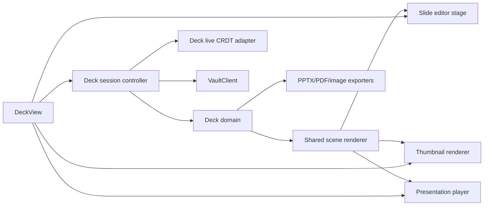

# Collab Presentations Plan

## Status

Phase 0 is complete except for its external-application and cross-platform
gates. The frozen contract, measurements, and decisions are in the
[Phase 0 Contract](./presentation-phase0-contract.md); where this plan and the
contract differ, the contract wins. Phases 1-10 are implemented; Phase 10 is
in release testing, general-release hardening Phase 1 is implemented, and
Phase 11 remains deferred.

This plan defines a first-party presentation editor for Collab. It follows the
same product boundary as Advanced Tables: Collab owns the editable document
format, editor behavior, collaboration semantics, and rendering model.
PowerPoint files are generated interoperability copies, not the live backing
format.

## Summary

Add a native `.deck` vault document with a dedicated desktop editor,
presentation mode, speaker notes, live hosted collaboration, offline copies,
mobile viewing, PDF/image export, and compatible `.pptx` export.

The first useful version should cover the normal academic and technical
presentation workflow:

- slide creation, duplication, deletion, sections, and reordering
- themes, masters, layouts, placeholders, and reusable templates
- text boxes with structured rich text, lists, links, and speaker notes
- shapes, lines, arrows, images, SVG, tables, and basic charts
- alignment, distribution, snapping, grouping, locking, and z-order
- presentation mode with keyboard, touch, and presenter controls
- local/hosted vault persistence, revisions, live editing, and offline merge
- deterministic PDF/image output and a documented `.pptx` export boundary

`.pptx` import is intentionally deferred. It is substantially harder to make
honest and safe than export, and it is not required for the first production
release.

## Difficulty Assessment

This is harder than the spreadsheet integration.

Advanced Tables has one especially difficult computational subsystem
(formulas/recalculation) and one difficult renderer (the virtualized grid).
Presentations combine several difficult interactive systems:

- rich-text editing and text layout inside transformed boxes
- a vector scene editor with resize, rotate, group, snap, and z-order behavior
- master/layout inheritance and theme resolution
- consistent rendering across editor, thumbnails, playback, PDF, images, and
  PowerPoint export
- media loading, font availability, and asset portability
- presentation playback, transitions, animation sequencing, and speaker notes
- fine-grained collaboration for both objects and text

The largest risk is not drawing rectangles. It is preserving text wrapping,
layout, fonts, and object geometry consistently across platforms and in an
exported PowerPoint file.

Rough effort for one experienced engineer:

| Scope                                            | Estimate              |
| ------------------------------------------------ | --------------------- |
| Phase 0 proofs and frozen contract               | 2-4 weeks             |
| Native desktop MVP through presentation mode     | 12-18 weeks           |
| Collaboration, offline behavior, and PPTX export | 8-14 weeks            |
| Mobile viewer and release hardening              | 6-10 weeks            |
| Deferred bounded PPTX import                     | Additional 8-16 weeks |

These are engineering estimates, not release dates. Text fidelity and physical
PowerPoint/LibreOffice/Google Slides validation can move them materially.

## Product Contract

### Native File Type

- Extension: `.deck`
- Media type: `application/vnd.collab.deck+json`
- Document kind: `collab-deck`
- Initial schema version: `1`
- Storage: bounded, schema-versioned structured JSON
- One file represents one presentation with one or more slides

`.slides` is not recommended because it is strongly associated with Google
Slides in user-facing language. `.presentation` is verbose. `.deck` is short,
descriptive, and does not imply that Collab edits PowerPoint files in place.

### Authority And Conversion

- `.deck` is always the authoritative editable source.
- `.pptx`, PDF, SVG, PNG, and handout files are generated copies.
- Export never changes the open document's backing format.
- Unsupported export features are flattened, omitted, or approximated with a
  visible report; they are never silently claimed as compatible.
- Importing `.pptx` later creates a new `.deck` and preserves the source file
  unchanged.

PowerPoint's `.pptx` format is an OOXML package containing separate
presentation, slide, master, layout, theme, relationship, notes, and media
parts. Collab should not reproduce that package structure in `.deck`; it is an
interchange concern handled only by the exporter/importer boundary.

## Initial Schema Direction

Phase 0 freezes the exact types, but the schema should use stable IDs and maps
rather than index-addressed nested arrays:

```ts
interface DeckDocument {
  kind: 'collab-deck';
  schemaVersion: 1;
  id: string;
  name: string;
  createdAt: string;
  updatedAt: string;
  size: DeckSize;
  themeId: string;
  themes: Record<string, DeckTheme>;
  masters: Record<string, DeckMaster>;
  layouts: Record<string, DeckLayout>;
  slides: Record<string, DeckSlide>;
  slideOrder: string[];
  sections?: DeckSection[];
  metadata?: Record<string, unknown>;
}

interface DeckSlide {
  id: string;
  name?: string;
  layoutId?: string;
  hidden?: boolean;
  background?: DeckFill;
  elements: Record<string, DeckElement>;
  elementOrder: string[];
  speakerNotes?: DeckRichText;
  transition?: DeckTransition;
  animations?: DeckAnimation[];
}

type DeckElement =
  | DeckTextElement
  | DeckShapeElement
  | DeckLineElement
  | DeckImageElement
  | DeckTableElement
  | DeckChartElement
  | DeckGroupElement
  | DeckEmbedElement;
```

### Coordinate Model

- Store slide geometry as bounded integer logical units, not CSS pixels.
- Default slide ratio is widescreen 16:9.
- Permit documented standard ratios and explicit custom sizes.
- Store font sizes in points and rotation in normalized degrees.
- Convert logical units to CSS pixels for editing and to English Metric Units
  only inside the PPTX exporter.
- Use one geometry implementation for hit testing, handles, snapping, playback,
  thumbnails, and export.

Integer geometry avoids collaborative floating-point drift and makes
deterministic serialization practical.

### Stable Identity

Slides, sections, elements, groups, paragraphs, animation steps, theme tokens,
masters, and layouts need stable IDs.

Stable IDs are required for:

- concurrent edits to different objects
- slide and object reordering
- comments and presence
- source-linked note embeds
- animation targets
- master/layout inheritance
- reference rewrites
- deterministic undo/redo and recovery

### Rich Text

Stored text must be a Collab-owned paragraph/run model, not HTML and not a
third-party editor's serialized state.

It should support:

- paragraphs with stable IDs
- text runs with font, size, weight, style, color, decoration, and language
- bullet/numbered lists with bounded nesting
- alignment, indentation, line spacing, and paragraph spacing
- links and explicit soft/hard breaks
- theme font/color references with explicit local overrides
- auto-fit policy: none, shrink text, or grow box

Phase 0 should evaluate Lexical as an editing adapter. It is MIT licensed,
React-compatible, accessible, and has Yjs support, but Lexical state must not
become the `.deck` schema. A smaller first-party `contenteditable` adapter
remains viable if the proof shows that Lexical introduces more state
synchronization complexity than it removes.

### Themes, Masters, And Layouts

Theme and layout behavior must be built early, not added after slide editing:

- theme color and font tokens
- slide background defaults
- slide masters
- named layouts
- placeholders with type and stable identity
- inherited objects with explicit override records
- header/footer/date/slide-number placeholders

The Collab application theme controls editor chrome only. A deck's visual theme
is document content and must render identically in dark, light, warm, and
midnight application themes.

### Assets

Images, video, audio, SVG, and other binary content remain normal vault assets.
A deck element stores a vault-relative reference plus stable metadata such as
media type, intrinsic dimensions, content hash, alt text, and crop.

- Hosted/offline opening must prefetch or resolve required assets through
  `VaultClient` and the replica.
- Rename/move/trash reference analysis must include `.deck`.
- PPTX/PDF/package export embeds the required asset bytes.
- Remote URL media is not authoritative. It must be explicitly imported or
  represented by a safe static preview plus link.
- Missing assets render a stable placeholder and remain repairable.

## Renderer And Editor Architecture


```mermaid
flowchart LR
    V["DeckView"] --> S["Deck session controller"]
    V --> E["Slide editor stage"]
    V --> T["Thumbnail renderer"]
    V --> P["Presentation player"]
    S --> D["Deck domain"]
    S --> C["Deck live CRDT adapter"]
    S --> VC["VaultClient"]
    D --> R["Shared scene renderer"]
    R --> E
    R --> T
    R --> P
    D --> X["PPTX/PDF/image exporters"]
```

### Rendering Split

Use a fixed-aspect slide stage with a logical coordinate transform:

- DOM/SVG scene layer for visible slide objects
- SVG path layer for shapes, lines, connectors, and selection guides
- DOM text layer for accurate editing, selection, IME, and accessibility
- independent transform overlay for selection bounds, resize, rotate, crop,
  alignment, and snapping handles
- viewport virtualization for slide thumbnails and large decks

Do not render the entire editor as one canvas. Canvas-only text editing and
accessibility would create avoidable problems. Do not use one independent React
state owner per element; the scene should subscribe to normalized document
state and render stable object components.

### Shared Scene Renderer

Editor, thumbnails, presentation mode, image export, and print/PDF must consume
the same resolved slide scene. They may use different output adapters, but
layout resolution cannot be forked.

The resolver owns:

- master/layout inheritance
- theme token resolution
- object transforms and group transforms
- crop and clipping
- z-order
- text box geometry and auto-fit decisions
- connector anchors
- table and chart bounds
- animation base/final states

### Editing Interactions

The desktop editor should provide:

- left slide/section navigator
- central slide stage
- compact context-sensitive toolbar
- right properties/animation panel
- notes area below the stage
- zoom, fit, rulers, guides, grid, and snapping
- keyboard movement, resize, duplicate, group, order, and text-edit commands
- multi-select, marquee select, align, distribute, lock, group, and ungroup
- paste from clipboard as text, image, SVG, or bounded sanitized rich content

The first screen is the editor, not a landing page or template advertisement.

## Collaboration And Offline Model

The generic `useLiveJsonDocumentSession` is a useful starting point for slide
and object structure because stable-ID object arrays already reconcile
independently. It is not sufficient for concurrent editing inside the same text
run because primitive strings are replaced atomically.

The production collaboration model should add a deck-specific live codec:

- `Y.Map` for document, theme, slide, and element records
- `Y.Array` for stable ordered slide, element, paragraph, and animation IDs
- `Y.Text` with formatting attributes for paragraph/run content
- semantic transactions for move, resize, style, grouping, layout, and
  animation operations
- awareness for active slide, selected elements, text cursor, and presenter
  state
- local undo scoped to the user's transaction origins

`collab-live` and server materialization need an explicit `Deck` document kind
that converts this live structure into normalized `.deck` JSON revisions. The
normal live WebSocket ticket, state-vector handshake, backend-proxied socket,
offline replica, reconnect merge, and revision materialization paths remain
authoritative.

Required concurrent behavior:

- users editing different slides merge independently
- users editing different objects on one slide merge independently
- concurrent text edits in one text box merge at text-operation granularity
- move/resize versus delete produces a deterministic visible result
- reordering does not lose concurrent property edits
- offline edits survive restart and reconcile on reconnect
- viewer-role users can observe but cannot mutate
- live state materializes to ordinary `.deck` JSON for history, export, and
  non-live readers

## PowerPoint Export Contract

Compatible `.pptx` export is a release requirement, not an optional final idea.

### Recommended Boundary

Phase 0 should prove PptxGenJS behind a Collab-owned adapter. It is MIT
licensed, supports browser/React/Vite use, and can generate OOXML presentations
containing text, shapes, images, tables, charts, and slide masters. It can
return an `ArrayBuffer`/`Blob`, which fits the existing native save-dialog and
download boundary.

The dependency must remain isolated under a module such as:

```text
src/lib/deck/pptx/
  exportDeckToPptx.ts
  mapTheme.ts
  mapText.ts
  mapShapes.ts
  mapTables.ts
  mapCharts.ts
  exportReport.ts
```

PptxGenJS types must not leak into `DeckDocument`, the editor, collaboration
operations, or the shared scene model. The exporter should be lazy-loaded.

### Required First Export Matrix

The production export gate should cover:

- standard and custom slide sizes
- slide order, hidden slides where supported, titles, and sections where
  practical
- themes, master/layout mapping, backgrounds, and placeholders
- rich text, lists, links, alignment, spacing, and common font styles
- shapes, fills, borders, opacity, lines, arrows, and rotation
- raster images, SVG with tested fallback, crop, and transparency
- basic tables and charts
- speaker notes if the Phase 0 exporter proof confirms reliable support
- slide numbers and common footer placeholders

Initially flattened or omitted with an explicit report:

- unsupported custom geometry
- filters/blend modes not representable in DrawingML
- Collab source links and internal metadata
- unsupported fonts
- complex chart features
- video/audio features not proven portable
- animations/transitions outside the tested export subset

### Compatibility Validation

Every release must test generated files in:

- current Microsoft PowerPoint desktop
- current LibreOffice Impress
- current Google Slides import
- Apple Keynote when a macOS validation machine is available

Tests compare visible semantics, not ZIP bytes:

- slide count/order/size
- text content and wrapping tolerances
- element bounds, rotation, and z-order
- theme colors/fonts and fallbacks
- image crop and transparency
- table/chart values
- notes and links where supported

The UI shows an export report before or after save with exported, approximated,
flattened, omitted, and missing-font/asset counts.

## PDF, Image, And Note Integration

- Export the full deck or selected slides to PDF.
- Export a slide as PNG and SVG where all content is representable.
- Insert a selected slide into a note as a source-linked SVG/PNG snapshot.
- Activating that embed reopens the `.deck` at the source slide.
- Re-export can replace a stable generated asset so note links stay current.
- Export printable handouts with configurable slides per page and optional
  speaker notes.
- Link presentation tables/charts to explicit `.sheet` snapshots or stable
  ranges, with manual refresh and a persisted static fallback.

## Presentation And Presenter Modes

Presentation mode needs:

- fullscreen slide playback
- next/previous and direct slide navigation
- keyboard, mouse, touch, and remote-command handling
- black/white screen, laser pointer, and temporary ink
- slide progress and optional timer
- presenter view with current slide, next slide, notes, and elapsed time
- deterministic recovery if the presenter window closes or display topology
  changes
- reduced-motion behavior

Temporary ink, pointer position, and presenter state are ephemeral and must not
mutate the deck unless the user explicitly saves annotations.

## Mobile Scope

Mobile begins as a viewer and presentation companion:

- open local/offline hosted `.deck` copies
- responsive slide list and fit-to-screen viewer
- pinch zoom and pan
- speaker notes
- presentation navigation and optional remote-control mode
- comments and bounded text correction later

Full slide composition on a phone is not an initial goal. Tablet editing can be
evaluated after the desktop editor and mobile viewer are stable.

## Security And Resource Bounds

Phase 0 must freeze limits for:

- document bytes
- slides, masters, layouts, themes, and sections
- elements and text per slide/deck
- group depth and transform complexity
- image dimensions and decoded pixel budgets
- table rows/columns/cells
- chart series/points
- animation count and duration
- clipboard/import payload bytes
- export memory and wall-clock time

Security requirements:

- no macros, scripts, arbitrary HTML, or executable embedded objects
- no implicit network fetches
- sanitize pasted HTML and SVG
- validate vault-relative asset references
- bound archive, XML, relationship, and decompression processing for future
  PPTX import
- reject cyclic master/layout/group references
- reject NaN, infinite, or out-of-range geometry
- treat fonts and media as untrusted inputs
- perform export in a worker or bounded native job so the UI stays responsive

## Progress Tracker

| Phase                                                 | Status   | Goal                                                                                                                |
| ----------------------------------------------------- | -------- | ------------------------------------------------------------------------------------------------------------------- |
| 0. Product contract and technical proofs              | Testing  | Freeze `.deck`, prove scene/text fidelity, rich-text editing, live text collaboration, and PPTX export.             |
| 1. `.deck` domain and vault integration               | Complete | Add schema, validation, migrations, creation, routing, references, revisions, and normal local/hosted lifecycle.    |
| 2. Desktop scene editor foundation                    | Complete | Build slide navigation, stage rendering, selection, transforms, snapping, ordering, clipboard, and undo/redo.       |
| 3. Rich text, themes, masters, and layouts            | Complete | Deliver text editing, placeholders, theme inheritance, reusable layouts, and templates.                             |
| 4. Visual objects and Collab data integration         | Complete | Add images, SVG, shapes, lines, groups, tables, charts, `.sheet` snapshots, and note links.                         |
| 5. Presentation mode and speaker workflow             | Complete | Add fullscreen playback, notes, presenter view, navigation, handouts, and PDF/image output.                         |
| 6. Hosted collaboration and offline behavior          | Complete | Add the deck-specific CRDT codec, awareness, offline replica merge, recovery, and physical multi-client validation. |
| 7. Compatible PPTX export                             | Complete | Generate tested `.pptx` copies with a support matrix and visible conversion report.                                 |
| 8. Mobile viewer and presentation companion           | Complete | Add offline viewing, notes, touch navigation, playback, and remote controls.                                        |
| 9. Transitions and animations                         | Complete | Add a bounded timeline, preview/playback, reduced motion, and a tested PPTX-compatible subset.                      |
| 10. Performance, accessibility, and release hardening | Testing  | Validate large decks, fonts, packaging, recovery, keyboard/screen-reader operation, and target applications.        |
| 11. Deferred PPTX import                              | Deferred | Convert a bounded supported subset of `.pptx` into a new `.deck` with a detailed import report.                     |

## Phase Details

### Phase 0: Product Contract And Technical Proofs

- Freeze extension, media type, schema, coordinate units, limits, and
  compatibility language.
- Build a 3-5 slide renderer proof with text, shapes, image crop, tables, and
  theme inheritance.
- Prove identical scene output in editor, thumbnail, and presentation mode.
- Compare text measurement/wrapping on Linux, Windows, and Android WebView.
- Evaluate Lexical versus a smaller first-party text adapter without persisting
  editor-specific state.
- Prove same-text-box collaboration with `Y.Text` formatting.
- Generate PPTX fixtures through an isolated PptxGenJS adapter and inspect them
  in PowerPoint, LibreOffice, and Google Slides.
- Prove PDF and slide-image output.
- Record dependency licenses, bundle impact, and worker feasibility.

Exit gate: no editor implementation begins until text layout, CRDT text,
coordinate conversion, and PPTX export are demonstrably feasible.

### Phase 1: `.deck` Domain And Vault Integration

Complete. A `.deck` is now an ordinary vault document everywhere the app
handles documents. The view is display-and-navigate only; authoring starts in
Phase 2.

- [x] `src/types/deck.ts` and the framework-free `src/lib/deck/` domain (Phase 0).
- [x] Parse, repair-and-report normalization, migration dispatch, validation,
      deterministic serialization, default theme, master, and five layouts
      (`document.ts`). Ordering damage, dangling layout/theme/master
      references, mismatched ids, and empty decks are repaired and reported;
      wrong kind, bad schema version, hard limits, and still-invalid structure
      refuse to open. A newer schema opens read-only and untouched.
- [x] Bounded `.deck` validation in `collab-documents`
      (`crates/collab-documents/src/deck.rs`), wired into `classify_path` and the
      shared `validate` dispatch, tested against the TypeScript fixture itself
      (`crates/collab-documents/fixtures/deck-fixture.deck`, kept identical by
      `sharedFixture.test.ts`).
- [x] **New presentation** in the Files header menu, the folder context menu,
      and the command bar; file-tree icon and **Presentations** filter;
      duplication; import classification (with structural validation); `deck`
      tab type; link resolution; version history; routing to `DeckView`.
- [x] Hosted document type end to end: `HostedDocumentType::Deck`, migrations
      0031 (enum value) and 0032 (reclassify earlier `.deck` uploads, which were
      stored as notes), server reference and validation dispatch, archive
      import, and the admin app. The upload path and migration 0031 are proven
      against live PostgreSQL; 0032 mirrors ink's 0029 reclassification.
- [x] Reference collection and rename/move rewrites for images, image fills,
      embed sources and previews, chart `.sheet` sources, and vault links in
      any text body. Found by field role, so references inside table cells,
      backgrounds, and notes are covered. A deleted target is deliberately left
      in place so the missing-asset placeholder stays repairable.
- [x] Loading and saving through `VaultClient` and `DocumentSessionController`
      (`useDeckSession`), with conflict, offline-queue, and status-bar
      registration. Every edit is re-validated before it can be saved.
- [x] Device-local view state (`editorStore.deckViewStates`: slide, zoom,
      panels, selection) that follows renames and moves and never enters the
      document.

Found and fixed along the way:

- The hosted parser caps made the Phase 0 32 MiB limit unreachable; the limit
  is amended in the contract and enforced on the client.
- Before the `deck` type, the server stored `.deck` uploads as notes, and the
  Android app opens note-typed documents in its Markdown editor — where saving
  would overwrite a presentation. Mobile now receives `deck` and shows the
  file-details sheet until the Phase 8 viewer.
- Vault ZIP import classified `.ink` drawings as opaque assets; they now import
  as ink documents.

Deliberately deferred: live co-editing (Phase 6 owns `LiveDocumentKind::Deck`),
so a concurrent edit surfaces as a conflict; a dedicated Android widget icon
(Phase 8); slide-size choice at creation (widescreen by default).

### Phase 2: Desktop Scene Editor Foundation

Complete. `DeckView` is now an editor for slides and objects; text editing
arrives in Phase 3.

- [x] Reversible operations (`src/lib/deck/operations.ts`): insert, delete,
      move, hide, and duplicate slides (sections follow their slide); add,
      remove, update, reorder, group, ungroup, and lock elements. Each returns
      the new deck and its exact inverse as a patch of touched slides, so the
      ink history (`InkHistory`) is reused unchanged.
- [x] Virtualized slide rail with section headers, multi-select, drag reorder,
      and a context menu (`DeckSlideRail`).
- [x] Stage (`DeckStage`): fit, Ctrl+wheel zoom about the pointer, zoom
      buttons and shortcuts, middle-button or Space-drag pan.
- [x] Select, Shift/Ctrl multi-select, marquee, move, resize (along a rotated
      object's own axes; groups and multi-selections scale about their
      bounds), rotate (Shift snaps to 15°), image crop (double-click an image,
      drag an edge; the image keeps its scale), lock, group, ungroup, order,
      align (to slide or selection), and distribute
      (`src/lib/deck/transform.ts`).
- [x] Snapping to slide edges and centre and to other objects, with smart
      guides; optional quarter-inch grid; rulers. Alt suspends snapping.
- [x] Keyboard: arrows nudge 1 pt (Shift 10 pt), Tab cycles objects, Delete,
      Ctrl+A/D/G/Shift+G, Ctrl+[ ] ordering, slide navigation and reordering
      in the rail. Clipboard: elements copy as a marked JSON payload in
      `text/plain` (placeholders become self-contained), paste cascades, and
      plain text pastes as a text box.
- [x] Undo/redo bounded at 200 steps; a gesture previews on a scratch deck
      and commits once, as one undo step and one save. Autosave is the session
      controller's debounced save; every edit is re-validated first. History
      is cleared when the deck changes underneath (reload, conflict).
- [x] Handles, guides, outlines, and hit slop are sized in screen pixels, so
      they stay constant under zoom and device scaling.

Deliberately deferred: guides placed by dragging from the rulers (smart guides,
grid, and rulers are in); cropping shapes and masks (Phase 4); text editing and
object styling beyond a text box and basic shapes (Phases 3 and 4).

### Phase 3: Rich Text, Themes, Masters, And Layouts

Complete. Text is edited in place, placeholders behave as in PowerPoint, and a
deck's design — theme, master, and layouts — is editable document content.
No schema change was needed: everything Phase 3 stores was already in the
frozen version 1 schema.

- [x] Paragraph/run text editor: the first-party `contenteditable` adapter the
      contract chose (`DeckTextEditor`). Every change arrives through
      `beforeinput`, the clipboard, or composition end and is applied to the
      model by offset-addressed operations (`richText.ts`) whose id rules match
      the `Y.Text` encoding, so Phase 6 can map them one-to-one. The DOM is
      redrawn from the model with text nodes only. Double-click, Enter, or F2
      edits; a new text box opens for typing.
- [x] Typing is a draft written to the document on a 400 ms idle timer and when
      editing ends; one editing session is one deck undo step, while Ctrl+Z
      inside the editor walks a finer local history (typing bursts, deletions,
      splits, formatting).
- [x] Toolbar and shortcuts (`DeckTextToolbar`, `textCommands.ts`): font
      (theme heading/body or a named family), size and grow/shrink, bold,
      italic, underline, strike, superscript, subscript, theme or custom
      colour, alignment including justify, bullets, numbering, list levels
      (Tab/Shift+Tab), line and paragraph spacing, links, clear formatting,
      and autofit, vertical alignment, and wrap. Toggles read the resolved
      style, so un-bolding an inherited bold title stores `bold: false`. With
      a box selected rather than edited, commands apply to its whole text. A
      toggle on a caret sets the format of what is typed next.
- [x] Links to web addresses (`http`, `https`, `mailto` only) and to slides;
      they draw in the theme's hyperlink colour, underlined, unless the run
      says otherwise. Rich copy and paste inside Collab keeps formatting;
      everything else pastes as plain text.
- [x] Auto-fit: `shrink` and `grow` in the editor as in output; "resize box to
      fit text" writes the height the text needs when editing ends.
- [x] Font fallback: the picker and the design panel show which families are
      not installed and which fallback actually draws (`fonts.ts`).
- [x] CJK line breaking, the contract's Phase 3 requirement: breaks between
      CJK characters by grapheme (`Intl.Segmenter`), with the common kinsoku
      sets — no closing punctuation, small kana, or prolonged sound mark at a
      line start and no opening bracket at a line end. Justified paragraphs
      stretch every wrapped line.
- [x] Placeholders: empty placeholders show their layout's prompt text (or
      "Click to add title" and so on) with a dashed outline in the editor only
      — never in thumbnails, playback, exports, or the file. Overrides are
      just properties a slide element sets; "Reset to layout" removes them and
      keeps text, links, and levels. Changing a slide's layout keeps matching
      placeholders, removes empty ones the layout lacks, keeps ones with
      content where they were drawn, and adds the new layout's placeholders.
      Subtitles take the body style without its bullets.
- [x] Theme editing: all twelve colour slots and the heading and body fonts,
      in the design panel (`DeckInspector`).
- [x] Master and layout editor ("Edit master and layouts"): a rail of masters
      and their layouts with usage counts; the stage edits a layout's or
      master's own elements with every element operation; placeholders can be
      inserted; layouts renamed, duplicated, or deleted when unused; layout
      background and "show master artwork"; master background and per-level
      text styles (size, theme font, bold, italic, colour, bullet, indent).
- [x] Speaker notes are edited in the notes panel with the same editor.
- [x] Built-in designs (`templates.ts`): Collab, Lecture, Midnight, and Paper,
      each a theme, master, and six layouts (Title slide, Title and content,
      Two content, Section header, Title only, Blank) built for the deck's
      size. New decks use Collab; the design panel applies any of them to an
      existing deck, keeping content and slide-level overrides, as one undo
      step. Every template uses the same layout ids.

Measured in the real editor (Chromium, through a Playwright-driven harness):
typing, arrow-key and mouse selection, word deletion, soft and hard breaks,
IME composition, paste, and double-click word selection all edit the model
correctly, and the edited box lines up with the engine's rendering. The
harness found and fixed one real defect — a late `selectionchange` re-render
could drag the caret back a keystroke — which jsdom could not show.

Deliberately deferred: choosing a template in the "New presentation" flows (the
design panel applies one immediately after); rich HTML paste from other
applications (plain text for now); picture placeholders (Phase 4); the
knife-edge wrap measurement in the Linux WebKitGTK and Windows WebView2 apps,
which stays with the Phase 0 device checks.

### Phase 4: Visual Objects And Collab Data Integration

Complete. Everything the schema already described can now be created and
edited. As in Phase 3, no schema change was needed.

- [x] Insert gallery: text box, all fourteen preset shapes, lines and arrows,
      images, tables, five chart types, and linked documents. After an insert
      from a menu or dialog, focus returns to the slide, so keys act on the new
      object.
- [x] Object formatting toolbar (`DeckObjectToolbar`): fill (theme, custom, or
      none), outline colour, weight, and dash, arrowheads at either end,
      change shape, opacity, flip, and rotate 90°. Groups are formatted
      through the objects they hold. The design panel adds numeric position,
      size, rotation, and alt text for one selected object.
- [x] Lines are edited by dragging either end (Shift snaps to 45°, the grid
      applies, Alt suspends it), not by a bounding box.
- [x] Images (PNG, JPEG, GIF, WebP, SVG) from the vault, from the computer, by
      paste, or by dropping files on a slide. Outside files are imported
      beside the deck (`<deck> assets/`); the deck only ever references vault
      paths. Media type, byte, and decoded-pixel limits are enforced at insert
      (`images.ts`), pixel size and content hash are recorded, and images
      arrive at their own aspect ratio, never enlarged past their pixels.
      Crop (Phase 2), reset crop, and replace image keep working.
- [x] Groups: nesting past eight levels is refused when grouping, matching
      the validator; resizing and rotating groups was already Phase 2.
- [x] Tables: insert a blank table (header row styled from the theme as
      explicit cell content) or a copy of a workbook range. Double-click or
      Enter edits a cell with the same rich-text editor; Tab and Shift+Tab move
      between cells; rows grow to fit as you type. Insert and delete rows and
      columns (merged cells follow), header row, and cell fill. Resizing a
      table scales its rows and columns, so frame and tracks always agree.
- [x] Charts: column, bar (now drawn horizontally), line, area, and pie, with
      a data editor. A chart can read a `.sheet` range once — formulas are
      evaluated by the spreadsheet's own engine — and stores the range as
      `source`; **Refresh** reads it again on request. Series keep their ids
      and colours across refreshes. Nothing reads a workbook without a person
      asking.
- [x] Linked documents (`DeckEmbedElement`): a note link shows a generated
      preview (title and opening lines, escaped SVG) written beside the deck;
      **Refresh preview** regenerates it at the same path. Other documents
      show a card with their name and path. Double-click opens the source.
- [x] Stable slide exports: "Export as image for notes" in the slide list
      writes the slide as SVG to `<deck> assets/slide-<slide id>.svg` —
      keyed by slide id, so reordering never retargets it, and re-exporting
      replaces it in place — and copies Markdown that shows it in a note and
      links back to the deck.
- [x] Asset caching keys on path and content hash, so a preview or export
      replaced at the same path is read again.

Checked in Chromium through the editor harness: tables with cell editing,
Tab navigation, and row growth; a bar chart read from a workbook range; the
shape gallery; and a linked note's preview. The harness also caught focus
returning to the menu button after an insert, which let keystrokes reach the
toolbar; focus now returns to the slide.

Deliberately deferred: connectors anchored to shapes and image masks need new
schema fields (a version 2 decision); ported OOXML preset formulas are still
approximations; a link from a note to a specific slide (the deck opens at its
remembered slide); PNG slide exports and PPTX handling of SVG images (Phase 7).

### Phase 5: Presentation Mode And Speaker Workflow

Complete. Presenting and every export read the deck and never write it; the
only way playback changes a deck is keeping ink, which the person chooses. No
schema change was needed.

- [x] Slide show (`DeckPresenter`): full screen (the app window, or the
      browser's full screen outside the app), from the beginning (F5) or this
      slide (Shift+F5). Next: click, tap, Space, →, ↓, Page Down, Enter, N,
      wheel, or a left swipe; previous: right click, ←, ↑, Page Up,
      Backspace, P, or a right swipe; Home and End; a number and Enter goes
      to that slide, hidden or not. Hidden slides are otherwise skipped. After
      the last slide an end screen waits for one more click or Esc. Links on
      slides work: slide links jump, web links open in the browser, vault
      links end the show and open the document. Keys never reach the editor
      behind the show.
- [x] Presenter view (Alt+F5, or from the show): current slide with the same
      tools, next slide, speaker notes with adjustable size, a timer that can
      pause and reset (T, R), the clock, and slide position. The slides go to
      a second display in a separate audience window (`presentWindow.ts`); the
      display can be changed during the show. With one display the presenter
      view rehearses in place, and "Show slides here" switches to the show.
- [x] Temporary ink and pointers: pen, highlighter, and whole-stroke eraser
      in six colours (Ctrl+P, Ctrl+I, Ctrl+E; E clears the slide), laser
      pointer (L), black and white screen (B or ., W or ,), and a slide grid
      (G or -). Ink is kept per slide for the length of the show. On exit, if
      anything was drawn, the editor asks whether to keep it: kept ink becomes
      a transparent, full-slide SVG image on each slide drawn on (written
      beside the deck under a new name each time), as one undo step.
- [x] Recovery: the audience window holds no document — it draws frames the
      presenter sends — so losing it loses nothing. If it closes or its
      display disappears (checked every three seconds), the show continues in
      the main window at the same slide with ink and timer intact, and says
      so. Leaving the show restores the window's previous full-screen state.
- [x] Reduced motion: slides cross-fade only when motion is on (the app
      setting and the system preference); otherwise they cut.
- [x] PDF export: slides, or handouts on A4 or Letter in either orientation
      with 1, 2, 3, 4, 6, or 9 slides per page, optionally with speaker notes
      (a notes page for 1, slide-and-notes rows for 2 or 3). All slides
      (hidden ones optional), the current slide, the selected slides, or a
      range such as `1-3, 5`. Rendering is cancellable, with progress, and
      saves through the native save dialog. Ctrl+P opens export and print.
- [x] The contract's open decision, decided: **raster pages with an invisible
      text layer** (`pdf.ts`). Each page is an image of the slide, so it
      matches the editor, and the words drawn on it are laid over it
      invisibly at the same place (`textLayer.ts`), so the PDF can be
      searched, selected, and copied, and read aloud. The text layer uses one
      composite font with a `ToUnicode` map built per document, so any script,
      including characters outside the Basic Multilingual Plane, extracts
      exactly (checked with pdf.js). Web and slide links become PDF links.
      The PDF has the deck's name as its title.
- [x] Slide images: PNG (1×, 2×, or 4×) or SVG, for one slide through the
      save dialog or several into a chosen folder, one file per slide.
- [x] Print: the same slide or handout pages, as vector SVG, through the
      system print dialog, one sheet per page at its exact size.

Checked in Chromium through the editor harness: the show, keyboard and mouse
navigation, blanking, pen and laser, the slide grid, keeping ink, the
presenter view, print of handouts, and a real rasterized handout PDF whose
text pdf.js extracts. The harness found two real defects, both fixed: the
Phase 0 rasterizer (`createImageBitmap` on an SVG blob) cannot decode SVG in
Chromium, so export now draws the SVG as an image into a canvas; and the next
slide preview did not scale.

Not checked here: the audience window on real second displays, which needs
the desktop app (the container cannot build it). Its window and permission
code is written against Tauri 2.12's API and capability names, and every call
falls back to single-window presenting.

Known limits: rasterized pages draw text with installed fonts, because an SVG
drawn as an image cannot use the page's web fonts (the inline editor and print
can); a deck using a web-only font rasterizes with its fallback. A dedicated
touch-remote and phone presenter are Phase 8.

### Phase 6: Hosted Collaboration And Offline Behavior

Complete. Hosted presentations are edited live; local vaults keep saving
through REST as before. No schema change.

- [x] `LiveDocumentKind::Deck` (`crates/collab-live`): a `deck` hosted file
      opens a live room seeded from its current revision, materializes back to
      ordinary `.deck` revisions after the quiet period, recovers a degenerate
      room from the canonical revision, and treats a REST revision racing live
      edits as a conflict, like the other structured kinds. The offline
      replica and reconnect handshake are the shared ones.
- [x] The deck codec, written twice and checked against each other: the
      desktop's (`liveDeckDocument.ts`) and the server's (`deck.rs`).
      Objects are `Y.Map`s, so different slides and objects merge; rich text
      is one `Y.Text` per body in the Phase 0 encoding, so typing in one box
      merges character by character and formats merge per key; geometry
      (`frame`, `crop`, line ends, `size`) is written whole, so two
      concurrent moves end at one position, never a mix of both. Both
      directions are pinned by checked-in updates: the server materializes
      the desktop's encoding of the shared fixture, and the desktop decodes
      the server's seed, each to exactly the fixture.
- [x] Materialization repairs what concurrency can leave: a slide or element
      ordered twice after two simultaneous moves, an order entry or group
      child for something a peer deleted, a section or layout reference to a
      deleted slide or layout. Delete wins over a concurrent move or edit.
      Integral numbers are written as integers.
- [x] Local edits stay whole-document operations; the desktop reconciles each
      into the smallest Yjs change — per-key map updates, id-keyed order
      moves, and for text a character diff that keeps unchanged characters in
      place and re-formats rather than re-types. One added element is one
      small update.
- [x] Typing while a collaborator types in the same box: the open draft is
      rebased on their change with a three-way merge on a scratch `Y.Text`,
      and the caret is carried through by relative position, so both people
      keep typing where they were.
- [x] Undo keeps working while others edit: it restores the objects this
      person changed (it is no longer cleared by a collaborator's edit).
- [x] Awareness: each editor publishes the slide (or layout or master) open,
      the selection, the text being typed in, and whether it is presenting.
      Collaborators appear on slide thumbnails, as outlines in their colour on
      the stage ("Robin is typing" on the box being edited), in the top bar,
      and as "… is presenting".
- [x] Read-only roles: viewers join the room and follow every change; the
      server refuses their updates and the editor never sends any.
- [x] A room that is empty, unreadable, or holds a different deck than the
      REST revision is discarded (with its offline cache) and REST stays in
      charge; a session that already has unsaved REST edits does not join.

Validated against real Yjs and Yrs: peer-to-peer merges of slides, objects,
and one text box, formatting racing typing, concurrent moves, double orders
and delete-versus-move (TypeScript and Rust), and the server end to end
against PostgreSQL — a deck room seeded from a revision, typing sent over the
socket into a rich-text `Y.Text`, and a valid revision materialized from it,
next to the existing viewer-enforcement, offline-reconnect, compaction, and
stale-revision room tests. In Chromium, two editors relayed live typed into
the same title at the same time and both kept their text and caret.

That check found a real defect in the Phase 0 text encoding, fixed and
recorded in the contract: empty styled runs — which carry a placeholder's
colour and font — were dropped, so a live deck's title placeholders lost their
colour.

Deliberately deferred: physical multi-machine soak tests (the protocol paths
are the ones every structured kind uses); undo through a Yjs undo manager
(undo restores whole objects, so it can overwrite a collaborator's later
change to the same object); following a presenter from another device (Phase
8); a group cycle created by two concurrent groupings is not repaired — the
room keeps it and materialization waits until someone ungroups.

### Phase 7: Compatible PPTX Export

Complete, apart from the PowerPoint and Google Slides checks the exit gate
names, which need those applications (see below). The published support
matrix is [PowerPoint Export Support Matrix](../desktop/presentation-pptx-export.md).

- [x] A first-party Office Open XML writer replaced PptxGenJS, as the Phase 0
      contract allowed. Evaluating `defineSlideMaster` showed PptxGenJS cannot
      express a compatible export: text placed in a layout placeholder loses
      its own position, master artwork is limited to a few object kinds, and
      it has no groups, theme colours, fields, or formatted notes. The writer
      (`src/lib/deck/pptx/`) owns the whole package, keeps the
      `exportDeckToPptx` signature, reads the shared resolved scene, and
      needs no DOM. The PptxGenJS dependency, its `image-size` override, and
      that advisory entry are gone.
- [x] The required matrix: exact slide size; order, names, sections, hidden
      slides; the deck theme as the file theme; every master and layout as a
      PowerPoint master and layout with artwork, backgrounds, and
      placeholders (custom prompts), slide placeholders linked to them;
      backgrounds; fully resolved rich text with lists, links, alignment,
      spacing, insets, and auto-fit (shrink written with Collab's scale);
      shapes, fills, outlines, dashes, opacity, rotation, flips; connectors
      with arrowheads; real groups; images with crop, opacity, and borders;
      SVG with a picture fallback; native tables with merges; native,
      editable charts with an embedded workbook; formatted speaker notes;
      live slide-number fields; alt text and names.
- [x] Assets are embedded from the deck's loaded images; SVGs get a PNG
      fallback rendered at twice their size. Fonts the machine lacks are
      reported with the family Collab drew instead.
- [x] Export runs in a worker (`exportWorker.ts`) with per-slide progress and
      cancellation, and saves through the native save dialog.
- [x] The report dialog after every export: counts by kind, each reason once
      with its slides, the fonts the file uses, and missing images.
- [x] Fixtures and visual-semantic comparison: `exportDeckToPptx.test.ts`
      checks that every part parses, every relationship resolves, every part
      has a content type, and the semantics above. `compatibility.test.ts`
      renders the fixture and a deck for each built-in design (29 slides) in
      LibreOffice Impress and compares each slide with Collab's rendering;
      at most 6% of pixels differ, all from font substitution and chart
      axis labels. python-pptx, an independent reader, reads masters,
      layouts, placeholders, groups, tables, charts, and notes back as
      written. In Chromium the real worker exported the fixture end to end.

Not validated here: Microsoft PowerPoint and Google Slides, which this
environment cannot run. The writer follows the schema's element order
throughout, and both stay release validation items, as in Phase 0.

Exit gate: representative decks open successfully and remain useful in
PowerPoint, LibreOffice Impress, and Google Slides without silent data loss.

### Phase 8: Mobile Viewer And Presentation Companion

Complete, apart from the physical-device checks, which need Android hardware
and are a release gate in
[Presentation Companion](../mobile/presentation-companion.md).

- [x] `.deck` routing: tapping a presentation (document type `deck` or the
      extension) opens `DeckScreen`; the files list shows a presentation icon.
      The phone views and presents; it never writes a deck.
- [x] Offline: the deck is read through the server and warms the replica
      cache, falling back to the cached copy. Images are found by vault path
      and read through the normal asset path (network, then cached bytes);
      ones the device does not have draw as placeholders, with a count.
- [x] Windowed slide thumbnails with sections and hidden slides; columns
      follow the width. A fitted slide view with pinch zoom about the fingers
      (100–500%), pan when zoomed, double-tap, and swipe navigation; speaker
      notes beside the slide in short landscape. Rendering is the shared
      resolver and `DeckSlide`.
- [x] Presenting on the phone with `playback.ts` rules (hidden slides skipped,
      tap and swipe navigation, end screen).
- [x] Live: the phone joins the deck's live room read-only
      (`openMobileLiveDeckSession`, decoded by the shared codec), so edits
      appear while viewing, and it publishes presence.
- [x] Optional desktop remote control (`src/lib/deck/remote.ts`): the
      presenter opts in with **Phone remote**; the phone publishes numbered
      commands for that show over awareness; the presenter applies each once,
      only from the same account and only while opted in. **Follow** keeps a
      phone on another presenter's slide.
- [x] App-wide remote discovery: a presenter heartbeats a bounded, ephemeral
      same-account advertisement while the show runs. Android checks connected
      accounts from `MobileApp`, shows a floating bubble without requiring the
      deck to be open, routes by stable server/vault/file identity, and enters
      the matching remote automatically. Stale shows expire after 20 seconds.
- [x] Direct phone control: negotiate a DTLS-encrypted, host-candidate WebRTC
      data channel through same-account deck awareness, report its state on the
      phone, and retain the numbered awareness relay as an automatic fallback.
- [x] Motion laser: calibrate Android orientation sensors on demand, send
      bounded normalized pointer samples over the direct channel or throttled
      relay, and support recenter/stop controls without changing the deck.
- [x] Presentation preferences: persist default show mode, preferred audience
      display, automatic phone-control opt-in, direct-control preference, and
      phone-start permission. Use themed display selection on Linux/WebKitGTK.
- [x] Phone-initiated start for an open deck: advertise an opted-in desktop in
      deck awareness and accept a deduplicated, same-account request targeted
      to that exact client. Cold-start/device-registry activation remains a
      separate future capability.
- [x] Slide, view, notes panel, zoom, and pan survive process recreation
      (`sessionStorage`, per file).
- [ ] Physical Android memory, rotation, process-recreation, offline, touch,
      and remote-control checks: release gate (see the companion doc).

Deferred to later phases as the plan says: comments and bounded text
correction on the phone.

### Phase 9: Transitions And Animations

Complete. The frozen Phase 0 fields are now authored and played rather than
being passive schema placeholders.

- [x] The inspector has a bounded, ordered per-slide build timeline. A selected
      object can gain an entrance, emphasis, or exit cue using appear, fade,
      fly/motion, or zoom, with on-click, with-previous, and after-previous
      timing, duration, delay, reordering, and removal. Every edit is one
      ordinary undoable/live document operation.
- [x] `animation.ts` compiles the linear stored list into deterministic build
      steps. Automatic cues run on slide entry; an advance consumes the next
      click build before moving slides, and previous walks builds back first.
      The slide show, presenter view, phone remote, and second-display audience
      window all use the same step state.
- [x] Fade, push, and wipe transitions have editor preview and playback with
      their stored duration. The existing app motion setting and the system
      reduced-motion preference reduce transitions and object effects to a
      cut.
- [x] Transient effects are scoped CSS over the shared SVG's stable
      `data-element` identities. They never rewrite an element frame, the
      resolved scene, or the `.deck` document, so geometry, collaboration,
      thumbnails, PDF, and image output remain static and deterministic.
- [x] PowerPoint export writes the proven fade/push/wipe transition subset,
      mapping Collab's exact duration to PowerPoint's nearest preset speed and
      reporting that approximation. Object animations remain outside the
      physically proven OOXML subset and are explicitly reported as omitted;
      their base objects remain visible.
- [x] Client and server validation now enforce transition/effect/phase/trigger
      enums, unique animation IDs, live targets, counts, durations, and delays.
      Unit coverage pins timeline grouping, transient states, click-before-
      slide playback, validation, audience frames, and PPTX reporting.

### Phase 10: Performance, Accessibility, And Release Hardening

Implemented; physical platform, assistive-technology, package, resource-soak,
and third-party-application evidence remains a release gate in
[Presentation Release Validation](../build/presentation-release-validation.md).

- [x] The automated gate covers the 300-slide budgets plus image-heavy,
      text-heavy, chart-heavy, and malformed/adversarial decks.
- [x] Keyboard authoring and presentation paths are pinned by editor,
      presenter, audience-window, and Android tests.
- [x] Slides expose bounded semantic object labels. The inspector authors
      object names and alt text, manages an independent reading order, and
      reports missing alt text, deterministic low contrast, backgrounds that
      need manual contrast review, and missing fonts/fallback previews.
- [x] Reading order is an optional additive v1 field, validated by TypeScript
      and Rust, repaired visibly on open, preserved by reversible operations,
      and merged through the deck CRDT without changing paint order.
- [x] Recovery/migration, encrypted-vault capability, immutable history,
      output, and package checks are mapped to executable repository gates; a
      sustained two-client structural/text/accessibility convergence soak is
      automated.
- [ ] Complete and attach the Linux, Windows, macOS, Android, print/PDF,
      package-asset, PowerPoint, Google Slides, Keynote, screen-reader,
      encrypted-vault, crash, and physical multi-client/resource matrix.

### Phase 11: Deferred PPTX Import

- Parse OOXML in a bounded native/worker boundary.
- Reject macros and active/external content.
- Convert supported slides, layouts, themes, text, shapes, images, tables,
  charts, notes, and transitions into a new `.deck`.
- Flatten or omit unsupported content with a per-slide import report.
- Preserve the source `.pptx` unchanged.
- Never promise lossless round trips.

### General-Release Hardening Phase 1

Implemented after the feature phases as the first focused usability and native
presentation pass:

- [x] Keep text and object formatting controls in one permanently mounted row,
      so selecting an object cannot move the stage beneath the pointer.
- [x] Focus the canvas when its blank surface is clicked; with no object
      selected, Left/Right and Up/Down move between slides.
- [x] Complete every resolved font stack with bundled and platform families.
      `Inter Variable`, shipped with Collab, is the first automatic substitute
      when a machine does not provide `Inter`.
- [x] Let the platform size ordinary full screen, and use Tauri's native
      monitor-targeted fullscreen API after creating the audience WebView at
      the output's logical viewport size and mapping it. This avoids unsupported
      absolute placement on Wayland, manual fullscreen resizing elsewhere, and
      stale hidden-WebView allocations on WebKitGTK.
- [x] Size the generated playback SVG through the Phase 9 animation wrapper;
      otherwise its intrinsic 1280×720 dimensions remain visible inside a
      correctly fullscreened presentation surface.
- [x] Give every audience attempt a unique native label and event namespace;
      cancel stale async opens during Strict Mode, display changes, or exit so
      an overlap cannot leave an extra black window behind.
- [x] Pin these behaviors with editor, font-resolution, and Tauri-window unit
      regressions. Native multi-monitor validation remains part of the physical
      release matrix.

### General-Release Hardening Phase 2

Implemented as the second focused editor and presentation-authoring pass:

- [x] A first completed click inside a text box enters its in-place editor,
      gives the contenteditable final keyboard focus, and puts the caret at the
      pointer. This prevents Backspace from reaching the canvas object-delete
      shortcut. Crossing the drag threshold still moves the box; its selection
      outline handles resize and rotate it.
- [x] Move object builds out of the design inspector into a dedicated Animation
      pane. Its tree groups the stored sequence by automatic slide entry and by
      click step, while each child retains ordered trigger, delay, and duration
      semantics.
- [x] Expand the native effect vocabulary with PowerPoint-aligned names:
      Appear, Fade, Fly In/Out, Float In/Out, Split, Wipe, Zoom, Swivel, Bounce,
      Blinds, Box, Checkerboard, Circle, Crawl In/Out, Diamond, Dissolve, Grow &
      Turn, Peek In/Out, Random Bars, Shape, Spiral In/Out, Stretch, Strips,
      Wheel, Pulse, Spin, Grow/Shrink, Teeter, Transparency, Blink, Color Pulse,
      Darken, Desaturate, Flicker, Lighten, and Wave. Desktop and Android use
      the same compiler and playback semantics.
- [x] Keep the format honest: these semantic names create a cleaner future
      PPTX mapping, but the current first-party PPTX writer still omits object
      animations and reports that omission instead of claiming fidelity.
- [x] Document phone remote discovery, opt-in, same-account trust, ephemeral
      command delivery, and its no-write boundary in
      `docs/mobile/presentation-companion.md`.

## Recommended Implementation Order

1. Complete Phase 0 before adding `.deck` routing.
2. Build the schema and shared scene resolver before a feature-heavy editor.
3. Deliver text, themes, and layouts before advanced objects.
4. Deliver useful native presentation and PDF/image output.
5. Add the deck-specific CRDT codec before calling hosted editing complete.
6. Make PPTX export a release gate.
7. Add mobile viewing after scene rendering is stable.
8. Add animation after static fidelity and collaboration are proven.
9. Treat PPTX import as a separate later program.

## Definition Of A Useful First Release

A first production release is useful when a user can:

1. Create a native `.deck` in a local or hosted vault.
2. Build a coherent themed slide deck with text, images, shapes, tables, and
   basic charts.
3. Present it reliably with notes.
4. Collaborate live and continue editing offline without losing changes.
5. Export PDF/images and a compatible `.pptx` copy.
6. Open the `.pptx` in maintained presentation applications with a truthful
   report for anything approximated or omitted.
